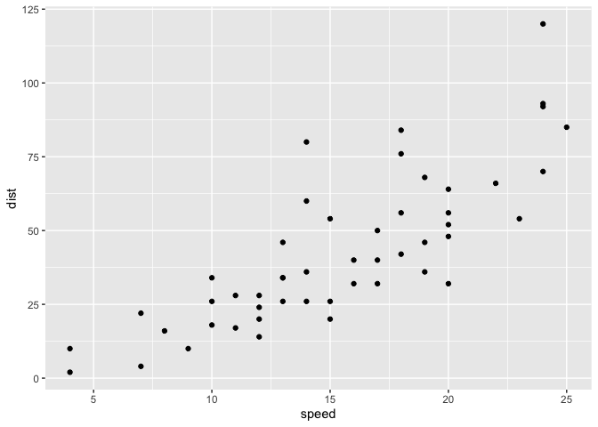
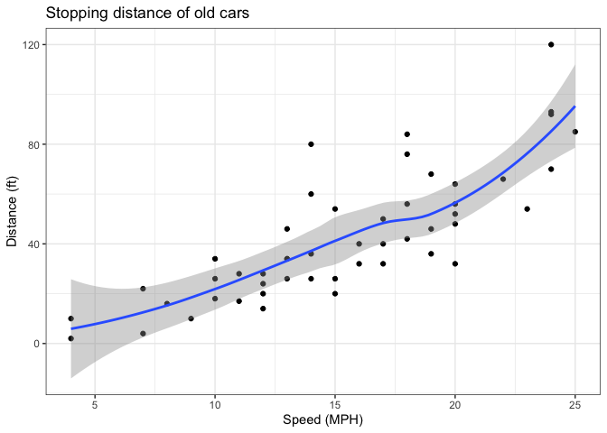
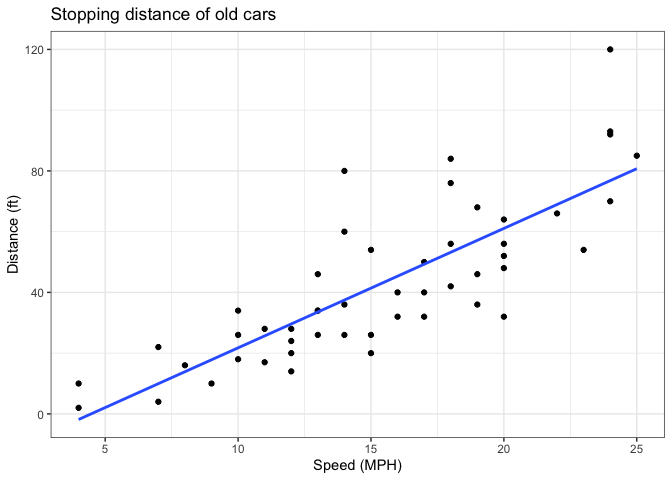
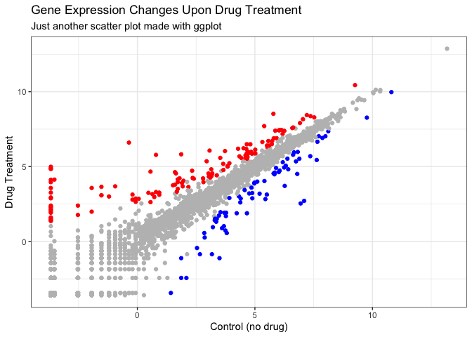
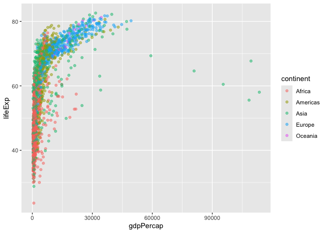
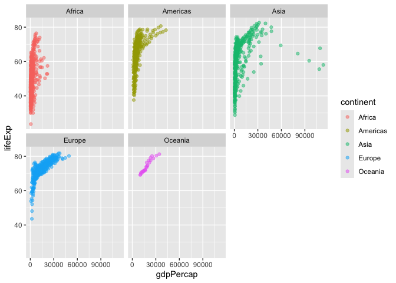
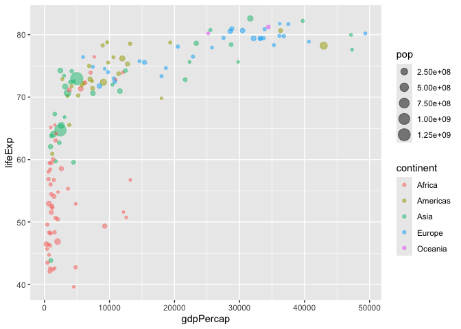
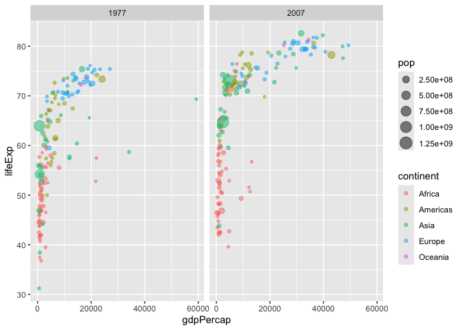
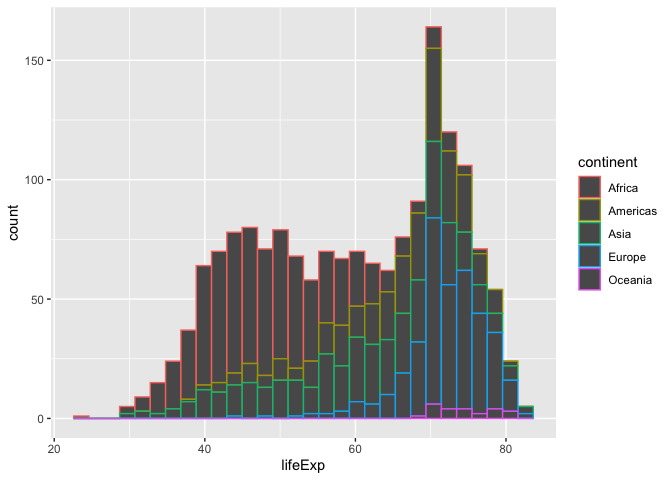

# Class 5: Data Viz with ggplot2
Seunghoon Oh (A19372132)

- [Background](#background)
- [Add some custom features](#add-some-custom-features)
- [Gene expression figure](#gene-expression-figure)
- [Going further](#going-further)

## Background

There are many graphics systems in R for making plots and figures. These
include so-called *“base R”* graphics like the `plot()` function and add
on packages like **ggplot2**.

Let’s compare how we make a simple figure with these two systems:

We can use the in-built `cars` dataset:

``` r
plot(cars)
```


Before I can use ggplot2 I need to install it on my computer. To do this
we can use the function `install.packages("ggplot2")`

> **N.B.** We never run `install.packages()` in our quarto doc (we run
> it once only in our R console) as it would re-install every time we
> render our quarto report.

Once installed we need to load up the package into our R brain
(session).

``` r
library(ggplot2)
```

The main function in **ggplot2** package is called `ggplot()`.

``` r
ggplot(cars)
```


Every ggplot has at least 3 layers:

- the **data** (a data.frame of the stuff we want to plot)
- the **aes**thetics (how the data maps to the plot)
- the **geom** layer (how you want the plot drawn, e.g. points, lines,
  etc.)

``` r
ggplot(cars) +
  aes(x=speed, y=dist) +
  geom_point()
```



## Add some custom features

Let’s add a trend line that shows the relationship between speed and
distance.

``` r
ggplot(cars) +
  aes(x=speed, y=dist) +
  geom_point() +
  geom_smooth() +
  theme_bw () +
  labs(title="Stopping distance of old cars", x="Speed (MPH)", y="Distance (ft)")
```

    `geom_smooth()` using method = 'loess' and formula = 'y ~ x'



Q. Can you make the `geom_smooth()` function produce straight line fit
to the data and turn off the “gray” error?

``` r
ggplot(cars) +
  aes(x=speed, y=dist) +
  geom_point() +
  geom_smooth(method="lm", se=FALSE) +
  theme_bw () +
  labs(title="Stopping distance of old cars", x="Speed (MPH)", y="Distance (ft)")
```

    `geom_smooth()` using formula = 'y ~ x'



------------------------------------------------------------------------

## Gene expression figure

Import the data to plot

``` r
url <- "https://bioboot.github.io/bimm143_S20/class-material/up_down_expression.txt"
genes <- read.delim(url)
head(genes, 10)
```

             Gene Condition1 Condition2      State
    1       A4GNT -3.6808610 -3.4401355 unchanging
    2        AAAS  4.5479580  4.3864126 unchanging
    3       AASDH  3.7190695  3.4787276 unchanging
    4        AATF  5.0784720  5.0151916 unchanging
    5        AATK  0.4711421  0.5598642 unchanging
    6  AB015752.4 -3.6808610 -3.5921390 unchanging
    7       ABCA7  3.4484220  3.8266509 unchanging
    8   ABCA9-AS1 -3.6808610 -3.5921390 unchanging
    9      ABCC11 -3.5288580 -1.8551732 unchanging
    10      ABCC3  0.9305738  3.2603040         up

``` r
sum(genes$State == "up")
```

    [1] 127

A useful new function in this context is the `table()` function:

``` r
table(genes$State)
```


          down unchanging         up 
            72       4997        127 

``` r
ggplot(genes) +
  aes(Condition1, Condition2, col=State) +
  geom_point() +
  labs(title="Gene Expression Changes Upon Drug Treatment", subtitle = "Just another scatter plot made with ggplot", x= "Control (no drug)", y= "Drug Treatment") +
  scale_color_manual(values=c("blue", "gray", "red")) +
  theme_bw() +
  theme(legend.position = "none")
```



## Going further

Here we read the famous gapminder dataset:

``` r
url <- "https://raw.githubusercontent.com/jennybc/gapminder/master/inst/extdata/gapminder.tsv"

gapminder <- read.delim(url)
head(gapminder)
```

          country continent year lifeExp      pop gdpPercap
    1 Afghanistan      Asia 1952  28.801  8425333  779.4453
    2 Afghanistan      Asia 1957  30.332  9240934  820.8530
    3 Afghanistan      Asia 1962  31.997 10267083  853.1007
    4 Afghanistan      Asia 1967  34.020 11537966  836.1971
    5 Afghanistan      Asia 1972  36.088 13079460  739.9811
    6 Afghanistan      Asia 1977  38.438 14880372  786.1134

> Q. How many entries (i.e. rows) are in this dataset?

``` r
nrow(gapminder)
```

    [1] 1704

> Q. How many countries are in this dataset?

``` r
length(unique(gapminder$country))
```

    [1] 142

Let’s make our first plot of the entire dataset Plot of “gdpPercap” vs
“lifeExp” colored by “continent”

``` r
p<-ggplot(gapminder) +
  aes (gdpPercap, lifeExp, col=continent) +
  geom_point(alpha=0.5)
```

``` r
p
```



I can add more layers to `p`

``` r
p +
  facet_wrap(~gapminder$continent)
```



Make a plot for 1977 and 2007 only (not all the years in dataset).

> Q. First use the **dplyr** package and the `filter()` function from
> that package to extract the year 2007.

``` r
library(dplyr)
```

``` r
g07<-filter(gapminder, year==2007)
g77<- filter(gapminder, year==1977)
g<- filter(gapminder, year == 2007 | year == 1977)

ggplot(g07) +
   aes (gdpPercap, lifeExp, col=continent, size=pop) +
   geom_point(alpha=0.5)
```



``` r
ggplot(g) +
   aes (gdpPercap, lifeExp, col=continent, size=pop) +
   geom_point(alpha=0.5)+
   facet_wrap(~year)
```



> Q. Make a histogram of lifeExp colored by continent (use
> `fill=continent` or `col=continent`)

``` r
ggplot(gapminder) +
  aes(lifeExp, fill=continent) +
  geom_histogram()
```


``` r
ggplot(gapminder) +
  aes(lifeExp, col=continent) +
  geom_histogram()
```



> Q. Make a histogram of lifeExp faceted by continent

``` r
ggplot(gapminder) +
  aes(lifeExp) +
  geom_histogram() +
  facet_wrap(~continent)
```


