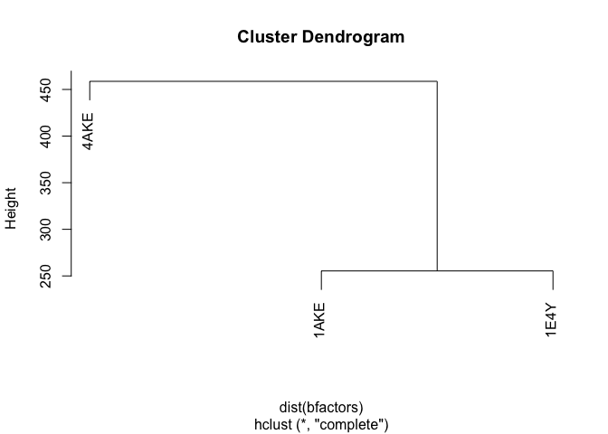
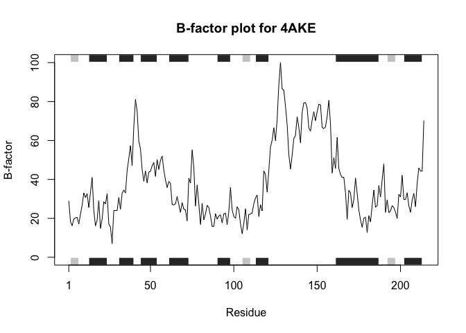
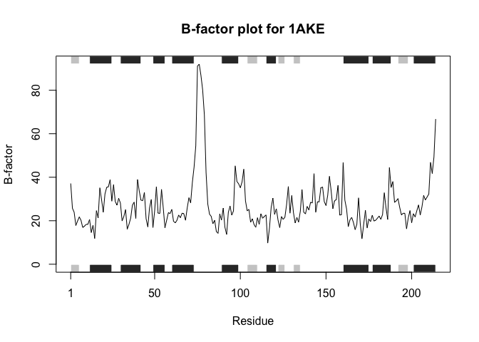
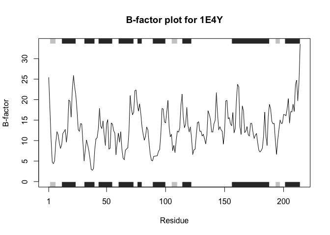

# HW06: R Functions HW
Seunghoon Oh (PID: A19372132)

- [Section 1B](#section-1b)
  - [The original code](#the-original-code)
  - [Q5](#q5)
  - [Q6](#q6)

## Section 1B

### The original code

I revised the typo in the line for s3.chainA (`s1` to `s3`)

``` r
# Can you improve this analysis code?
library(bio3d)
s1 <- read.pdb("4AKE") # kinase with drug
```

      Note: Accessing on-line PDB file

``` r
s2 <- read.pdb("1AKE") # kinase no drug
```

      Note: Accessing on-line PDB file
       PDB has ALT records, taking A only, rm.alt=TRUE

``` r
s3 <- read.pdb("1E4Y") # kinase with drug
```

      Note: Accessing on-line PDB file

``` r
s1.chainA <- trim.pdb(s1, chain="A", elety="CA")
s2.chainA <- trim.pdb(s2, chain="A", elety="CA")
s3.chainA <- trim.pdb(s3, chain="A", elety="CA")
s1.b <- s1.chainA$atom$b
s2.b <- s2.chainA$atom$b
s3.b <- s3.chainA$atom$b
plotb3(s1.b, sse=s1.chainA, typ="l", ylab="Bfactor")
```


``` r
plotb3(s2.b, sse=s2.chainA, typ="l", ylab="Bfactor")
```


``` r
plotb3(s3.b, sse=s3.chainA, typ="l", ylab="Bfactor")
```


### Q5

``` r
bfactors <- rbind(s1.b, s2.b, s3.b)
rownames(bfactors) <- c("4AKE", "1AKE", "1E4Y")
hc <- hclust(dist(bfactors))
plot(hc)
```



### Q6

The original code repeats an exact same process (code) for all three pdb
files 4AKE, 1AKE and 1E4Y: reading a PDB file, trimming chain A to CA
atoms, extracting the B-factors, and plotting them in a same format. By
defining a function `analyze_pdb_bfactor()`, we can generalize this for
any input pdb files.

There are three **inputs** for the function: `pdb_id`, which is a PDB ID
or file name, e.g. “4AKE”; `chain`, which is the protein chain we are
analyzing; `elety`, the atom type we keep while trimming the pdb input.
I have set the default value for `chain` as “A” and `elety` as “CA”, as
set in the original code.

Following **the process** of the original code, this function reads a
PDB file with structure data, trims it to the selected chain and atom
type, extracts the B-factor value, and plots the B-factor trend across
the protein. The **output** is a B-factor plot for the selected protein
structure. It also returns the B-factor values for future reuse.

``` r
analyze_pdb_bfactor <- function(pdb_id, chain = "A", elety = "CA") {
  pdb <- read.pdb(pdb_id)
  pdb_trimmed <- trim.pdb(pdb, chain = chain, elety = elety)
  b_factors <- pdb_trimmed$atom$b
  
  plotb3(
    b_factors,
    sse = pdb_trimmed,
    typ = "l",
    ylab = "B-factor",
    main = paste("B-factor plot for", pdb_id)
  )
  
  return(b_factors)
}
```

And we can apply the function for s1-s3 data.

``` r
s1.b <- analyze_pdb_bfactor("4AKE")
```

      Note: Accessing on-line PDB file

    Warning in get.pdb(file, path = tempdir(), verbose = FALSE):
    /var/folders/56/bn1513ts6_q_x93tzb1_q33r0000gn/T//RtmpRlz7l7/4AKE.pdb exists.
    Skipping download



``` r
s2.b <- analyze_pdb_bfactor("1AKE")
```

      Note: Accessing on-line PDB file

    Warning in get.pdb(file, path = tempdir(), verbose = FALSE):
    /var/folders/56/bn1513ts6_q_x93tzb1_q33r0000gn/T//RtmpRlz7l7/1AKE.pdb exists.
    Skipping download

       PDB has ALT records, taking A only, rm.alt=TRUE



``` r
s3.b <- analyze_pdb_bfactor("1E4Y")
```

      Note: Accessing on-line PDB file

    Warning in get.pdb(file, path = tempdir(), verbose = FALSE):
    /var/folders/56/bn1513ts6_q_x93tzb1_q33r0000gn/T//RtmpRlz7l7/1E4Y.pdb exists.
    Skipping download


