# Class 7: Machine Learning 1
Seunghoon Oh (PID: A19372132)

- [Background](#background)
- [K-means clustering](#k-means-clustering)
- [Hierarchical Clustering](#hierarchical-clustering)
- [Principal Component Analysis
  (PCA)](#principal-component-analysis-pca)
  - [Analysis of UK food data](#analysis-of-uk-food-data)
- [PCA of RNA-seq data (Optional)](#pca-of-rna-seq-data-optional)
  - [Data loading & PCA](#data-loading--pca)
  - [Additional visualization](#additional-visualization)
  - [Optional: Gene loadings](#optional-gene-loadings)

## Background

Today we will explore some core machine learning methods that are very
popular in bioinformatics. These include **clustering** and
**dimensionality reduction**.

## K-means clustering

The main function in “base” R for K-means clustering is called
`kmeans()`

Before we go too deep let’s make up some “simple” data that we can
cluster and know if we are getting a good answer or not. To do this we
can use the `rnorm()` function:

``` r
hist(rnorm(10000, mean = 3, sd=5))
```

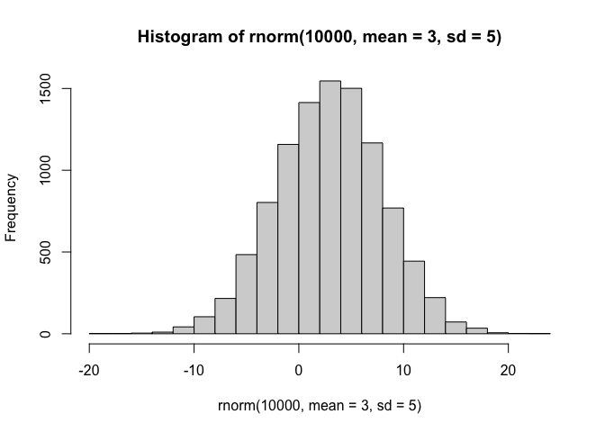

``` r
x <- c (rnorm(30, -3), rnorm(30,+3))
```

``` r
x
```

     [1] -2.1217126 -3.5384280 -2.8694863 -3.3371004 -1.5754606 -3.3595867
     [7] -3.2460350 -2.7013795 -4.1468870 -2.4273487 -4.3305336 -2.5039304
    [13] -2.7623526 -3.7740133 -4.5702789 -4.2176552 -1.9216833 -1.3748228
    [19] -3.0444465 -3.5280941 -3.8203935 -2.5454652 -1.7898640 -0.2196322
    [25] -2.1078826 -3.7897944 -3.9033711 -2.5449980 -3.0871126 -3.1670068
    [31]  1.6837326  1.6686332  3.6652985  0.9142342  2.4452997  4.7781422
    [37]  1.2474912  1.7783637  3.2523896  3.5598207  3.4388082  3.6014381
    [43]  2.6155241  1.0810689  2.1798119  0.9773260  1.1629587  2.5374459
    [49]  2.9295854  3.8374635  2.9006149  5.1515676  2.8850231  3.1097816
    [55]  2.1030208  3.3766806  2.2861952  3.7151756  2.8975459  2.5980991

``` r
#rev(x)
z <- cbind (x=x, y=rev(x))
plot(z)
```

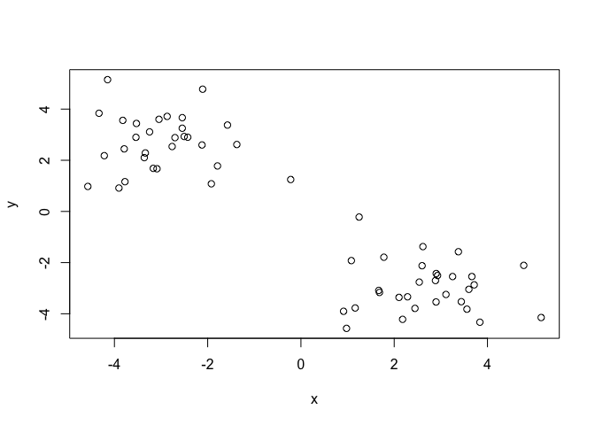

Now we can run `kmeans()` on this input `z` and see what the results
look like.

``` r
km <- kmeans(z, centers=2)
km
```

    K-means clustering with 2 clusters of sizes 30, 30

    Cluster means:
              x         y
    1  2.679285 -2.944225
    2 -2.944225  2.679285

    Clustering vector:
     [1] 2 2 2 2 2 2 2 2 2 2 2 2 2 2 2 2 2 2 2 2 2 2 2 2 2 2 2 2 2 2 1 1 1 1 1 1 1 1
    [39] 1 1 1 1 1 1 1 1 1 1 1 1 1 1 1 1 1 1 1 1 1 1

    Within cluster sum of squares by cluster:
    [1] 62.17808 62.17808
     (between_SS / total_SS =  88.4 %)

    Available components:

    [1] "cluster"      "centers"      "totss"        "withinss"     "tot.withinss"
    [6] "betweenss"    "size"         "iter"         "ifault"      

``` r
attributes(km)
```

    $names
    [1] "cluster"      "centers"      "totss"        "withinss"     "tot.withinss"
    [6] "betweenss"    "size"         "iter"         "ifault"      

    $class
    [1] "kmeans"

> Q. How many points are in each cluster?

``` r
km$size
```

    [1] 30 30

> Q. What “component” of your result object details cluster
> assignment/membership?

``` r
km$cluster
```

     [1] 2 2 2 2 2 2 2 2 2 2 2 2 2 2 2 2 2 2 2 2 2 2 2 2 2 2 2 2 2 2 1 1 1 1 1 1 1 1
    [39] 1 1 1 1 1 1 1 1 1 1 1 1 1 1 1 1 1 1 1 1 1 1

> Q. What “component” of your result object details cluster center?

``` r
km$centers
```

              x         y
    1  2.679285 -2.944225
    2 -2.944225  2.679285

> Q. Plot `z` colored by the kmeans cluster assignment and add cluster
> centers as blue points.

``` r
plot(z, col = km$cluster+2)
points(km$centers, col="red", pch=15)
```

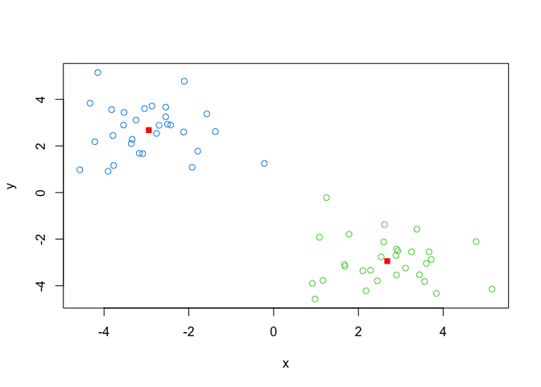

``` r
library(ggplot2)
ggplot(z, aes(x=x, y=y, colour=km$cluster)) +
  geom_point() +
  geom_point(data = km$centers, color = "red", size = 2)
```

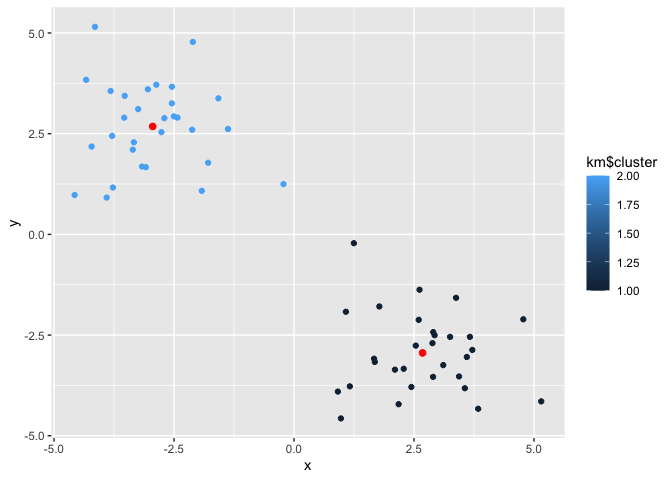

> Q. Run a K-means clustering and plot the results asking for 4 clusters
> (K=4)?

``` r
km4 <- kmeans(z, centers=4)
plot (z, col = km4$cluster+1)
points(km4$centers, col = 1)
```

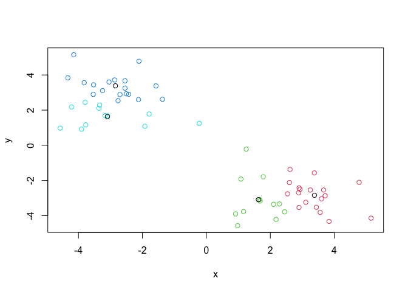

> **N.B.** You need to tell K-means the number of clusters (i.e. set
> `centers=2`)!!

One approach is to try different values for `centers` and then pick the
best…

``` r
ans <- NULL
for (i in 1:10) {
  km <- kmeans (z, centers=i)
  ans <- c(ans, km$tot.withinss)
}
```

``` r
ans
```

     [1] 1073.07206  124.35616  105.22545   85.42127   64.37161   57.51532
     [7]   57.28923   35.70121   36.32892   32.61855

``` r
plot(ans, type='o', xlab = "Number of Clusters", ylab = "Total Sum of Square Distances")
```

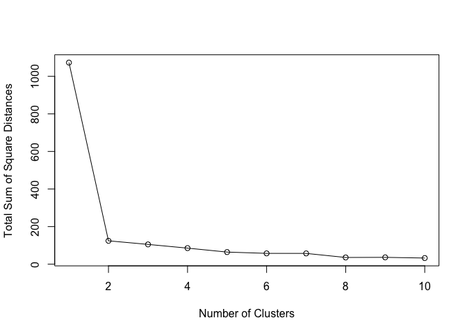

## Hierarchical Clustering

The main function in “base” R for Hierarchical Clustering is called
`hclust()`.

This function does not take your “raw” data for clustering. You must
first build a “distance matrix” (or “similarity matrix”) from your data
and pass this as input to `hclust()`.

``` r
d <- dist(z)
hc <- hclust(d)
```

There is a bespoke `plot()` method for `hclust()` result objects.

``` r
plot(hc)
abline(h=8, col="red")
```

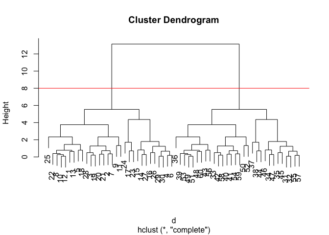

Once we have our `hclust` object (our “tree” of “cluster dendrogram”) we
can *“cut”* the tree to reval the clustering pattern.

``` r
cutree(hc, h=8)
```

     [1] 1 1 1 1 1 1 1 1 1 1 1 1 1 1 1 1 1 1 1 1 1 1 1 1 1 1 1 1 1 1 2 2 2 2 2 2 2 2
    [39] 2 2 2 2 2 2 2 2 2 2 2 2 2 2 2 2 2 2 2 2 2 2

``` r
cutree(hc, k=2)
```

     [1] 1 1 1 1 1 1 1 1 1 1 1 1 1 1 1 1 1 1 1 1 1 1 1 1 1 1 1 1 1 1 2 2 2 2 2 2 2 2
    [39] 2 2 2 2 2 2 2 2 2 2 2 2 2 2 2 2 2 2 2 2 2 2

> Q. Make a plot of `z` with your hclust results (i.e. colored by
> cluster membership)

``` r
plot(z, col=1+cutree(hc, k=2))
```

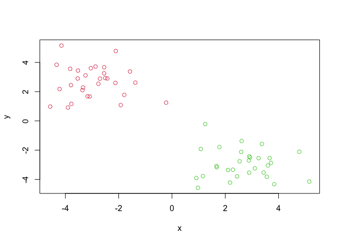

## Principal Component Analysis (PCA)

PCA is a dimensionality reduction method that is popular for revealing
patterns in complex datasets

### Analysis of UK food data

Let’s look at some data on the eating habits of folks from the UK to see
if there are patterns and trends that have some regions being distinct
from others.

#### Data Import

``` r
url <- "https://tinyurl.com/UK-foods"
x <- read.csv(url)
```

``` r
## Complete the following code to find out how many rows and columns are in x?
dim(x)
```

    [1] 17  5

``` r
## Preview the first 6 rows
#View(x)
head(x)
```

                   X England Wales Scotland N.Ireland
    1         Cheese     105   103      103        66
    2  Carcass_meat      245   227      242       267
    3    Other_meat      685   803      750       586
    4           Fish     147   160      122        93
    5 Fats_and_oils      193   235      184       209
    6         Sugars     156   175      147       139

#### Tidy data

Fix anything that went wrong with data import.

``` r
# Note how the minus indexing works
rownames(x) <- x[,1]
x <- x[,-1]
head(x)
```

                   England Wales Scotland N.Ireland
    Cheese             105   103      103        66
    Carcass_meat       245   227      242       267
    Other_meat         685   803      750       586
    Fish               147   160      122        93
    Fats_and_oils      193   235      184       209
    Sugars             156   175      147       139

``` r
dim(x)
```

    [1] 17  4

> Q2. Which approach to solving the ‘row-names problem’ mentioned above
> do you prefer and why? Is one approach more robust than another under
> certain circumstances?

``` r
x <- read.csv(url, row.names=1)
head(x)
```

                   England Wales Scotland N.Ireland
    Cheese             105   103      103        66
    Carcass_meat       245   227      242       267
    Other_meat         685   803      750       586
    Fish               147   160      122        93
    Fats_and_oils      193   235      184       209
    Sugars             156   175      147       139

This second approach is preferable, since the first approach removes the
first column every time we run the code line `x <- x[x,-1]`.

#### Exploratory analysis

Make some plots to help make sense of obvious trends…

``` r
# Using base R
barplot(as.matrix(x), beside=T, col=rainbow(nrow(x)))
```


> Q3: Changing what optional argument in the above barplot() function
> results in the following plot?

``` r
barplot(as.matrix(x), beside=F, col=rainbow(nrow(x)))
```


#### Optional part using tidyr and ggplot2

``` r
library(tidyr)

# Convert data to long format for ggplot with `pivot_longer()`
x_long <- x |> 
          tibble::rownames_to_column("Food") |> 
          pivot_longer(cols = -Food, 
                       names_to = "Country", 
                       values_to = "Consumption")

dim(x_long)
```

    [1] 68  3

``` r
head(x_long)
```

    # A tibble: 6 × 3
      Food            Country   Consumption
      <chr>           <chr>           <int>
    1 "Cheese"        England           105
    2 "Cheese"        Wales             103
    3 "Cheese"        Scotland          103
    4 "Cheese"        N.Ireland          66
    5 "Carcass_meat " England           245
    6 "Carcass_meat " Wales             227

``` r
library(ggplot2)
ggplot(x_long) +
  aes(x = Country, y = Consumption, fill = Food) +
  geom_col(position = "dodge") +
  theme_bw()
```


> Q4: Changing what optional argument in the above ggplot() code results
> in a stacked barplot figure?

``` r
ggplot(x_long) +
  aes(x = Country, y = Consumption, fill = Food) +
  geom_col(position = "stack") +
  theme_bw()
```


#### Back to plotting

> Q5: We can use the pairs() function to generate all pairwise plots for
> our countries. Can you make sense of the following code and resulting
> figure? What does it mean if a given point lies on the diagonal for a
> given plot?

``` r
pairs(x, col=rainbow(nrow(x)), pch=16)
```


This `pairs()` function compares food consumption amount for each
categories between two countries. Each food category is shown as a
distinct point. If a given point lies on the diagonal for a given plot,
that means that the food category indicated by the given point is
consumed in the same amount (or similar amount, if near diagonal) from
the paired two countries.

Then there is `pheatmap()`.

``` r
library(pheatmap)
pheatmap( as.matrix(x) )
```


> Q6. Based on the pairs and heatmap figures, which countries cluster
> together and what does this suggest about their food consumption
> patterns? Can you easily tell what the main differences between N.
> Ireland and the other countries of the UK in terms of this data-set?

England and Wales, then Scotland cluster togehter. Northern Ireland is
the most remote in terms of clustered patterns. This suggest that
England and Wales have the most similar food consumption pattern
together, and that Northern Ireland has the most distinctive pattern
from other regions.

It is not that easy to tell right away the difference between
consumption patterns among 17 different food categories. (though you can
say that the color in fresh_potatoes and fresh_fruits row is quite
different between regions, especially for N.Ireland)

#### PCA

The main function in “base” R for PCA is called `prcomp()`. This
function wants the “observations” to be rows and the “variables” to be
columns.

So here we need to take the transpose of our `x` input object

``` r
# Use the prcomp() PCA function 
pca <- prcomp( t(x) )
summary(pca)
```

    Importance of components:
                                PC1      PC2      PC3       PC4
    Standard deviation     324.1502 212.7478 73.87622 2.921e-14
    Proportion of Variance   0.6744   0.2905  0.03503 0.000e+00
    Cumulative Proportion    0.6744   0.9650  1.00000 1.000e+00

The returned `pca` object has components that we can use to make our
main result figures:

``` r
attributes(pca)
```

    $names
    [1] "sdev"     "rotation" "center"   "scale"    "x"       

    $class
    [1] "prcomp"

The main result figure from this analysis is called a “PC score plot” or
“ordination plot” “PC plot” or “PC1 vs PC2 plot”.

``` r
# Create a data frame for plotting
df <- as.data.frame(pca$x)
df$Country <- rownames(df)
```

> Q7. Complete the code below to generate a plot of PC1 vs PC2. The
> second line adds text labels over the data points.

``` r
# Plot PC1 vs PC2 with ggplot
ggplot(pca$x) +
  aes(x = PC1, y = PC2, label = rownames(pca$x)) +
  geom_point(size = 3) +
  geom_text(vjust = -0.5) +
  xlim(-270, 500) +
  xlab("PC1") +
  ylab("PC2") +
  theme_bw()
```

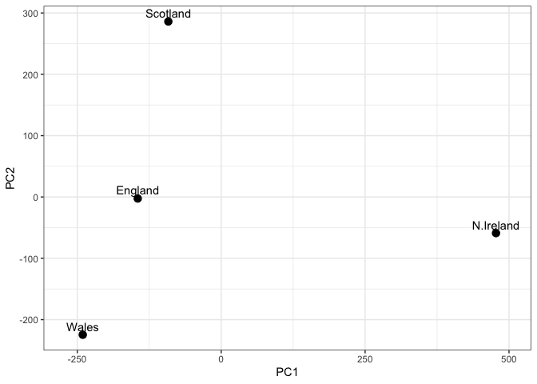

> Q8. Customize your plot so that the colors of the country names match
> the colors in our UK and Ireland map and table at start of this
> document.

``` r
ggplot(pca$x) +
  aes(x = PC1, y = PC2, label = rownames(pca$x)) +
  geom_point(size = 3) +
  geom_text(vjust = -0.5, color = c("orange", "red", "blue", "darkgreen")) +
  xlim(-270, 500) +
  xlab("PC1") +
  ylab("PC2") +
  theme_bw()
```

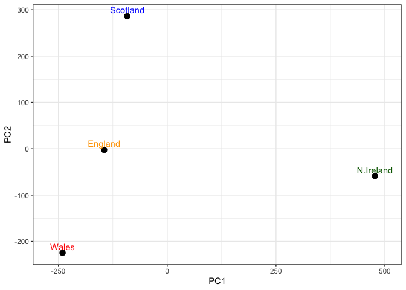

``` r
v <- round( pca$sdev^2/sum(pca$sdev^2) * 100 )
v
```

    [1] 67 29  4  0

``` r
## or the second row here...
z <- summary(pca)
z$importance
```

                                 PC1       PC2      PC3          PC4
    Standard deviation     324.15019 212.74780 73.87622 2.921348e-14
    Proportion of Variance   0.67444   0.29052  0.03503 0.000000e+00
    Cumulative Proportion    0.67444   0.96497  1.00000 1.000000e+00

``` r
# Create scree plot with ggplot
variance_df <- data.frame(
  PC = factor(paste0("PC", 1:length(v)), levels = paste0("PC", 1:length(v))),
  Variance = v
)

ggplot(variance_df) +
  aes(x = PC, y = Variance) +
  geom_col(fill = "steelblue") +
  xlab("Principal Component") +
  ylab("Percent Variation") +
  theme_bw() +
  theme(axis.text.x = element_text(angle = 0))
```


#### Digging deeper (variable loadings)

``` r
## Lets focus on PC1 as it accounts for > 90% of variance 
ggplot(pca$rotation) +
  aes(x = PC1, 
      y = reorder(rownames(pca$rotation), PC1)) +
  geom_col(fill = "steelblue") +
  xlab("PC1 Loading Score") +
  ylab("") +
  theme_bw() +
  theme(axis.text.y = element_text(size = 9))
```


> Q9: Generate a similar ‘loadings plot’ for PC2. What two food groups
> feature prominantly and what does PC2 mainly tell us about?

``` r
ggplot(pca$rotation) +
  aes(x = PC1, 
      y = reorder(rownames(pca$rotation), PC2)) +
  geom_col(fill = "steelblue") +
  xlab("PC2 Loading Score") +
  ylab("") +
  theme_bw() +
  theme(axis.text.y = element_text(size = 9))
```


In terms of absolute value of PC2 loading score, Fresh_fruit and
Alcoholic_drinks are the two prominant food groups. PC1 analysis cannot
cover 100% of the data, or the variation of categorical food consumption
between regions - and PC2 analysis covers a lot about this unexplained
portion.

## PCA of RNA-seq data (Optional)

### Data loading & PCA

``` r
url2 <- "https://tinyurl.com/expression-CSV"
rna.data <- read.csv(url2, row.names=1)
head(rna.data)
```

           wt1 wt2  wt3  wt4 wt5 ko1 ko2 ko3 ko4 ko5
    gene1  439 458  408  429 420  90  88  86  90  93
    gene2  219 200  204  210 187 427 423 434 433 426
    gene3 1006 989 1030 1017 973 252 237 238 226 210
    gene4  783 792  829  856 760 849 856 835 885 894
    gene5  181 249  204  244 225 277 305 272 270 279
    gene6  460 502  491  491 493 612 594 577 618 638

> Q10: How many genes and samples are in this data set? How many PCs do
> you think it will take to have a useful overview of this data set (see
> below)?

6 genes and 10 samples are in the dataset.

``` r
## Again we have to take the transpose of our data 
pca <- prcomp(t(rna.data), scale=TRUE)
summary (pca)
```

    Importance of components:
                              PC1    PC2     PC3     PC4     PC5     PC6     PC7
    Standard deviation     9.6237 1.5198 1.05787 1.05203 0.88062 0.82545 0.80111
    Proportion of Variance 0.9262 0.0231 0.01119 0.01107 0.00775 0.00681 0.00642
    Cumulative Proportion  0.9262 0.9493 0.96045 0.97152 0.97928 0.98609 0.99251
                               PC8     PC9    PC10
    Standard deviation     0.62065 0.60342 3.3e-15
    Proportion of Variance 0.00385 0.00364 0.0e+00
    Cumulative Proportion  0.99636 1.00000 1.0e+00

``` r
# Create data frame for plotting
df <- as.data.frame(pca$x)
df$Sample <- rownames(df)

## Plot with ggplot
ggplot(df) +
  aes(x = PC1, y = PC2, label = Sample) +
  geom_point(size = 3) +
  geom_text(vjust = -0.5, size = 3) +
  xlab("PC1") +
  ylab("PC2") +
  theme_bw()
```


PC1’s proportion of variance is 92.62% -\> One PC (PC1) would be enough
to show a useful overview of this data set. Adding PC2 would only add
2.31% of the total variance to the analysis.

### Additional visualization

``` r
# Calculate variance explained
pca.var <- pca$sdev^2
pca.var.per <- round(pca.var/sum(pca.var)*100, 1)

# Create scree plot data
scree_df <- data.frame(
  PC = factor(paste0("PC", 1:10), levels = paste0("PC", 1:10)),
  Variance = pca.var[1:10]
)

ggplot(scree_df) +
  aes(x = PC, y = Variance) +
  geom_col(fill = "steelblue") +
  ggtitle("Quick scree plot") +
  xlab("Principal Component") +
  ylab("Variance") +
  theme_bw()
```


``` r
## Percent variance is often more informative to look at 
pca.var.per
```

     [1] 92.6  2.3  1.1  1.1  0.8  0.7  0.6  0.4  0.4  0.0

``` r
# Create percent variance scree plot
scree_pct_df <- data.frame(
  PC = factor(paste0("PC", 1:10), levels = paste0("PC", 1:10)),
  PercentVariation = pca.var.per[1:10]
)

ggplot(scree_pct_df) +
  aes(x = PC, y = PercentVariation) +
  geom_col(fill = "steelblue") +
  ggtitle("Scree Plot") +
  xlab("Principal Component") +
  ylab("Percent Variation") +
  theme_bw()
```

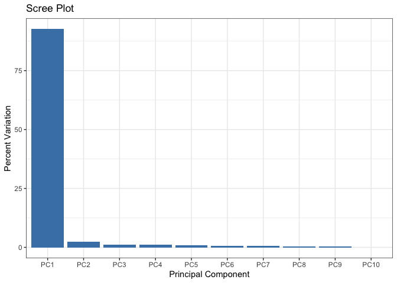

``` r
## A vector of colors for wt and ko samples
colvec <- colnames(rna.data)
colvec[grep("wt", colvec)] <- "red"
colvec[grep("ko", colvec)] <- "blue"

# Add condition to data frame
df$condition <- substr(df$Sample, 1, 2)
df$color <- colvec

ggplot(df) +
  aes(x = PC1, y = PC2, color = color, label = Sample) +
  geom_point(size = 3) +
  geom_text(vjust = -0.5, hjust = 0.5, show.legend = FALSE) +
  scale_color_identity() +
  xlab(paste0("PC1 (", pca.var.per[1], "%)")) +
  ylab(paste0("PC2 (", pca.var.per[2], "%)")) +
  theme_bw()
```

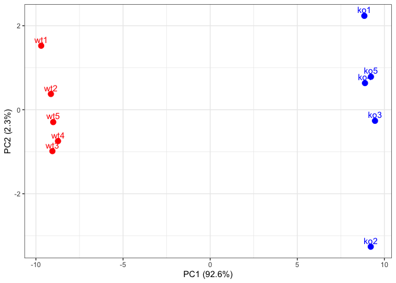

### Optional: Gene loadings

``` r
loading_scores <- pca$rotation[,1]

## Find the top 10 measurements (genes) that contribute
## most to PC1 in either direction (+ or -)
gene_scores <- abs(loading_scores) 
gene_score_ranked <- sort(gene_scores, decreasing=TRUE)

## show the names of the top 10 genes
top_10_genes <- names(gene_score_ranked[1:10])
top_10_genes 
```

     [1] "gene100" "gene66"  "gene45"  "gene68"  "gene98"  "gene60"  "gene21" 
     [8] "gene56"  "gene10"  "gene90" 
