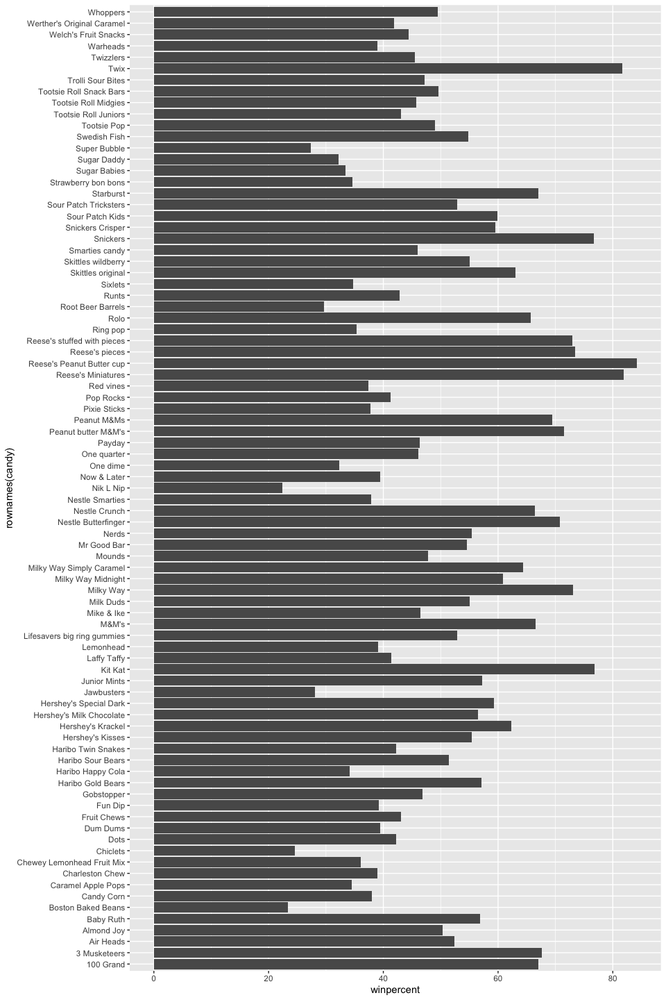
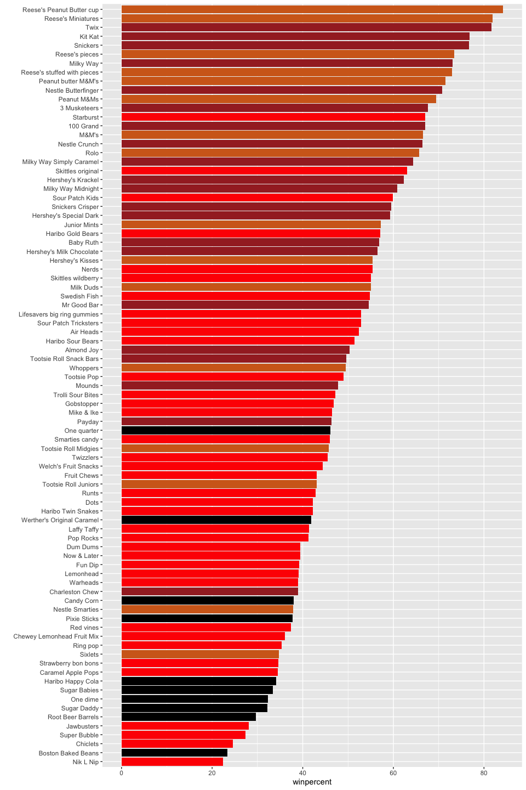
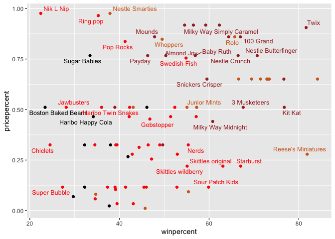
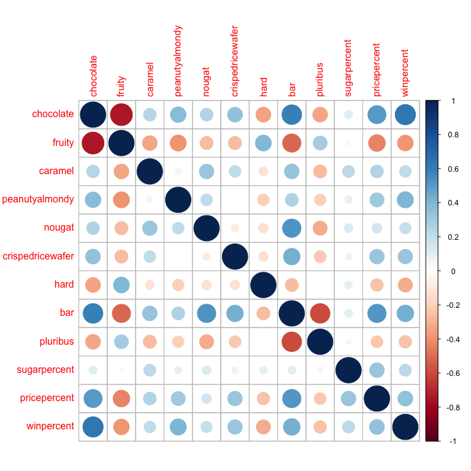
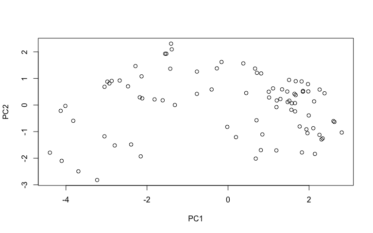
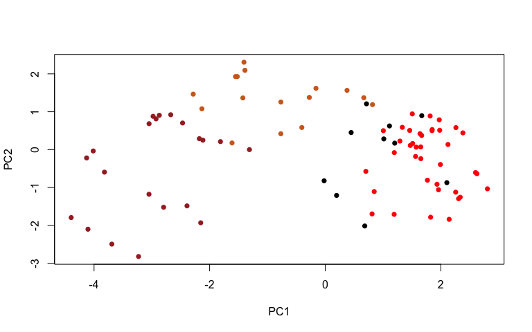
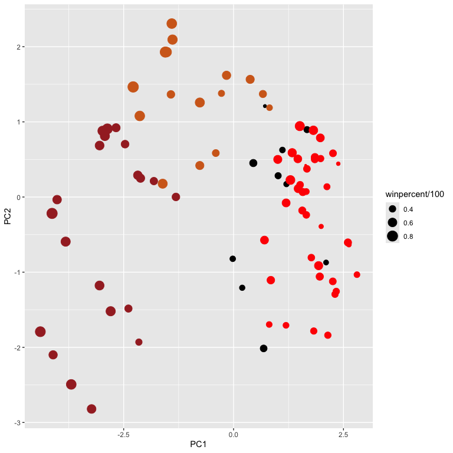
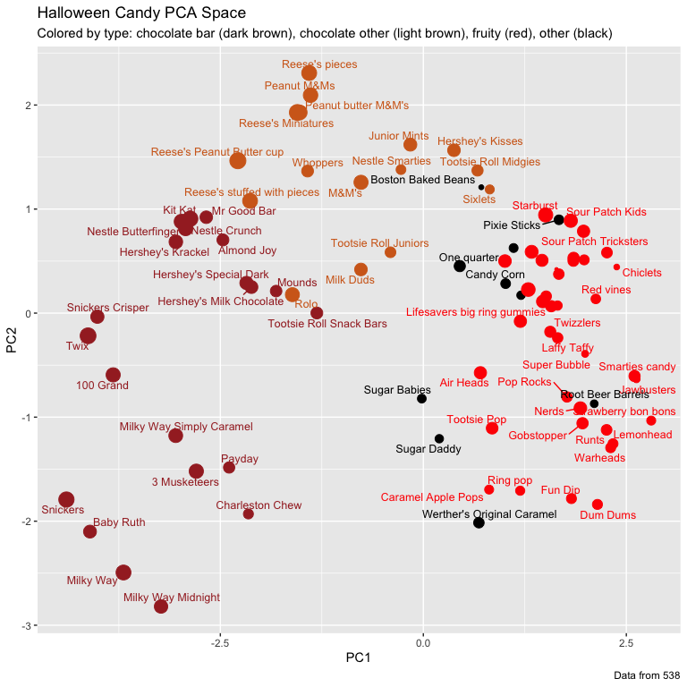

# Class 9: Candy Mini-Project
Seunghoon Oh (PID: A19372132)

- [Background](#background)
- [Importing candy data](#importing-candy-data)
  - [What is in the dataset?](#what-is-in-the-dataset)
  - [What is your favorite candy?](#what-is-your-favorite-candy)
  - [Side-note: the skimr::skim()
    function](#side-note-the-skimrskim-function)
- [Exploratory analysis](#exploratory-analysis)
- [Overall Candy Rankings](#overall-candy-rankings)
  - [Time to add some useful color](#time-to-add-some-useful-color)
- [Taking a look at pricepercent](#taking-a-look-at-pricepercent)
- [Exploring the correlation
  structure](#exploring-the-correlation-structure)
- [Principal Component Analysis](#principal-component-analysis)
  - [Using plotly to generate interactive
    plots](#using-plotly-to-generate-interactive-plots)
- [Summary](#summary)

## Background

Today we are takina a detour to analyze a fun dataset (that we have more
intrinsic insight into) with the most useful analysis method we have
learned thus far - Principal Compenent Analysis (PCA)

The data is all related to halloween candy and is from the 538 website.

## Importing candy data

``` r
candy_file <- "candy-data.csv"

candy = read.csv(candy_file, row.names=1)
head(candy)
```

                 chocolate fruity caramel peanutyalmondy nougat crispedricewafer
    100 Grand            1      0       1              0      0                1
    3 Musketeers         1      0       0              0      1                0
    One dime             0      0       0              0      0                0
    One quarter          0      0       0              0      0                0
    Air Heads            0      1       0              0      0                0
    Almond Joy           1      0       0              1      0                0
                 hard bar pluribus sugarpercent pricepercent winpercent
    100 Grand       0   1        0        0.732        0.860   66.97173
    3 Musketeers    0   1        0        0.604        0.511   67.60294
    One dime        0   0        0        0.011        0.116   32.26109
    One quarter     0   0        0        0.011        0.511   46.11650
    Air Heads       0   0        0        0.906        0.511   52.34146
    Almond Joy      0   1        0        0.465        0.767   50.34755

### What is in the dataset?

> Q1. How many different candy types are in this dataset?

``` r
nrow(candy)
```

    [1] 85

=\> there are 85 rows (which indicate different candy types) in this
dataset.

> Q2. How many fruity candy types are in the dataset?

``` r
nrow(candy[candy$fruity == 1, ])
```

    [1] 38

``` r
table(candy$fruity)
```


     0  1 
    47 38 

=\> There are 38 fruity candy types in the dataset.

### What is your favorite candy?

``` r
candy["Twix", ]$winpercent
```

    [1] 81.64291

``` r
library(dplyr)
```


    Attaching package: 'dplyr'

    The following objects are masked from 'package:stats':

        filter, lag

    The following objects are masked from 'package:base':

        intersect, setdiff, setequal, union

``` r
candy |> 
  filter(row.names(candy)=="Twix") |> 
  select(winpercent)
```

         winpercent
    Twix   81.64291

> Q3. What is your favorite candy (other than Twix) in the dataset and
> what is it’s winpercent value?

``` r
candy["Junior Mints", ]$winpercent
```

    [1] 57.21925

=\> 57.21925

> Q4. What is the winpercent value for “Kit Kat”?

``` r
candy["Kit Kat", ]$winpercent
```

    [1] 76.7686

=\> 76.7686

> Q5. What is the winpercent value for “Tootsie Roll Snack Bars”?

``` r
candy["Tootsie Roll Snack Bars", ]$winpercent
```

    [1] 49.6535

=\> 49.6535

### Side-note: the skimr::skim() function

``` r
#library("skimr")
skimr::skim(candy)
```

|                                                  |       |
|:-------------------------------------------------|:------|
| Name                                             | candy |
| Number of rows                                   | 85    |
| Number of columns                                | 12    |
| \_\_\_\_\_\_\_\_\_\_\_\_\_\_\_\_\_\_\_\_\_\_\_   |       |
| Column type frequency:                           |       |
| numeric                                          | 12    |
| \_\_\_\_\_\_\_\_\_\_\_\_\_\_\_\_\_\_\_\_\_\_\_\_ |       |
| Group variables                                  | None  |

Data summary

**Variable type: numeric**

| skim_variable | n_missing | complete_rate | mean | sd | p0 | p25 | p50 | p75 | p100 | hist |
|:---|---:|---:|---:|---:|---:|---:|---:|---:|---:|:---|
| chocolate | 0 | 1 | 0.44 | 0.50 | 0.00 | 0.00 | 0.00 | 1.00 | 1.00 | ▇▁▁▁▆ |
| fruity | 0 | 1 | 0.45 | 0.50 | 0.00 | 0.00 | 0.00 | 1.00 | 1.00 | ▇▁▁▁▆ |
| caramel | 0 | 1 | 0.16 | 0.37 | 0.00 | 0.00 | 0.00 | 0.00 | 1.00 | ▇▁▁▁▂ |
| peanutyalmondy | 0 | 1 | 0.16 | 0.37 | 0.00 | 0.00 | 0.00 | 0.00 | 1.00 | ▇▁▁▁▂ |
| nougat | 0 | 1 | 0.08 | 0.28 | 0.00 | 0.00 | 0.00 | 0.00 | 1.00 | ▇▁▁▁▁ |
| crispedricewafer | 0 | 1 | 0.08 | 0.28 | 0.00 | 0.00 | 0.00 | 0.00 | 1.00 | ▇▁▁▁▁ |
| hard | 0 | 1 | 0.18 | 0.38 | 0.00 | 0.00 | 0.00 | 0.00 | 1.00 | ▇▁▁▁▂ |
| bar | 0 | 1 | 0.25 | 0.43 | 0.00 | 0.00 | 0.00 | 0.00 | 1.00 | ▇▁▁▁▂ |
| pluribus | 0 | 1 | 0.52 | 0.50 | 0.00 | 0.00 | 1.00 | 1.00 | 1.00 | ▇▁▁▁▇ |
| sugarpercent | 0 | 1 | 0.48 | 0.28 | 0.01 | 0.22 | 0.47 | 0.73 | 0.99 | ▇▇▇▇▆ |
| pricepercent | 0 | 1 | 0.47 | 0.29 | 0.01 | 0.26 | 0.47 | 0.65 | 0.98 | ▇▇▇▇▆ |
| winpercent | 0 | 1 | 50.32 | 14.71 | 22.45 | 39.14 | 47.83 | 59.86 | 84.18 | ▃▇▆▅▂ |

> Q6. Is there any variable/column that looks to be on a different scale
> to the majority of the other columns in the dataset?

9 variables, from `chocolate` to `pluribus`, has a value of either 0
or 1. (`int` type) Other 3 variables that end with `percent` is a
`numeric` type value. These store an actual number rather than
categorical assignment as other 9 variables.

And among those 3 variables, `winpercent` has a different scale because
values for other “percent” variables are between 0 and 1, while this
variable has values between 0 and 100.

> Q7. What do you think a zero and one represent for the
> candy\$chocolate column?

I think it is basically same as a logical value -\> `0` represents
`False` and `1` represents `True`. So for the candy\$chocolate column,
`0` would indicate that the candy type is **not a chocolate (type
candy)** and `1` would indicate that it **is a chocolate (type candy)**

## Exploratory analysis

> Q8. Plot a histogram of winpercent values using both base R and
> ggplot2.

Using base R:

``` r
hist(candy$winpercent)
```


Using ggplot2:

``` r
library(ggplot2)
ggplot (candy, aes(winpercent)) + 
  geom_histogram()
```

    `stat_bin()` using `bins = 30`. Pick better value `binwidth`.


> Q9. Is the distribution of winpercent values symmetrical?

From the plots in Q8, **No**.

> Q10. Is the center of the distribution above or below 50%?

Center of the distribution would be:

``` r
median(candy$winpercent)
```

    [1] 47.82975

which is **below** 50%.

> Q11. On average is chocolate candy higher or lower ranked than fruit
> candy?

``` r
chocolate_winpercent <- mean(candy$winpercent[candy$chocolate == 1])
fruity_winpercent <- mean(candy$winpercent[candy$fruity == 1])
cat ("chocolate_winpercent", chocolate_winpercent, "\n")
```

    chocolate_winpercent 60.92153 

``` r
cat ("fruity_winpercent", fruity_winpercent, "\n")
```

    fruity_winpercent 44.11974 

``` r
chocolate_winpercent > fruity_winpercent
```

    [1] TRUE

=\> Chocolate candies have **higher** winpercent average than fruity
candies.

Using `as.logical()`:

``` r
mean(candy$winpercent[as.logical(candy$chocolate)])
```

    [1] 60.92153

``` r
mean(candy$winpercent[as.logical(candy$fruity)])
```

    [1] 44.11974

> Q12. Is this difference statistically significant?

``` r
choc_winperc_data <- candy$winpercent[as.logical(candy$chocolate)]
fruit_winperc_data <- candy$winpercent[as.logical(candy$fruity)]

t.test (choc_winperc_data, fruit_winperc_data)
```


        Welch Two Sample t-test

    data:  choc_winperc_data and fruit_winperc_data
    t = 6.2582, df = 68.882, p-value = 2.871e-08
    alternative hypothesis: true difference in means is not equal to 0
    95 percent confidence interval:
     11.44563 22.15795
    sample estimates:
    mean of x mean of y 
     60.92153  44.11974 

=\> The difference is statistically significant, as it has a very low
p-value (\<\<0.05). This indicates that the null hypothesis is rejected
and that the observed difference is likely not due to chance.

## Overall Candy Rankings

> Q13. What are the five least liked candy types in this set?

Using base R:

``` r
head(candy[order(candy$winpercent),], n=5)
```

                       chocolate fruity caramel peanutyalmondy nougat
    Nik L Nip                  0      1       0              0      0
    Boston Baked Beans         0      0       0              1      0
    Chiclets                   0      1       0              0      0
    Super Bubble               0      1       0              0      0
    Jawbusters                 0      1       0              0      0
                       crispedricewafer hard bar pluribus sugarpercent pricepercent
    Nik L Nip                         0    0   0        1        0.197        0.976
    Boston Baked Beans                0    0   0        1        0.313        0.511
    Chiclets                          0    0   0        1        0.046        0.325
    Super Bubble                      0    0   0        0        0.162        0.116
    Jawbusters                        0    1   0        1        0.093        0.511
                       winpercent
    Nik L Nip            22.44534
    Boston Baked Beans   23.41782
    Chiclets             24.52499
    Super Bubble         27.30386
    Jawbusters           28.12744

Using dplyr:

``` r
candy |>
  arrange(winpercent) |>
  head(5)
```

                       chocolate fruity caramel peanutyalmondy nougat
    Nik L Nip                  0      1       0              0      0
    Boston Baked Beans         0      0       0              1      0
    Chiclets                   0      1       0              0      0
    Super Bubble               0      1       0              0      0
    Jawbusters                 0      1       0              0      0
                       crispedricewafer hard bar pluribus sugarpercent pricepercent
    Nik L Nip                         0    0   0        1        0.197        0.976
    Boston Baked Beans                0    0   0        1        0.313        0.511
    Chiclets                          0    0   0        1        0.046        0.325
    Super Bubble                      0    0   0        0        0.162        0.116
    Jawbusters                        0    1   0        1        0.093        0.511
                       winpercent
    Nik L Nip            22.44534
    Boston Baked Beans   23.41782
    Chiclets             24.52499
    Super Bubble         27.30386
    Jawbusters           28.12744

=\> **Nik L Nip, Boston Baked Beans, Chiclets, Super Bubble,
Jawbusters**

> Q14. What are the top 5 all time favorite candy types out of this set?

``` r
head(candy[order(candy$winpercent, decreasing=TRUE),], n=5)
```

                              chocolate fruity caramel peanutyalmondy nougat
    Reese's Peanut Butter cup         1      0       0              1      0
    Reese's Miniatures                1      0       0              1      0
    Twix                              1      0       1              0      0
    Kit Kat                           1      0       0              0      0
    Snickers                          1      0       1              1      1
                              crispedricewafer hard bar pluribus sugarpercent
    Reese's Peanut Butter cup                0    0   0        0        0.720
    Reese's Miniatures                       0    0   0        0        0.034
    Twix                                     1    0   1        0        0.546
    Kit Kat                                  1    0   1        0        0.313
    Snickers                                 0    0   1        0        0.546
                              pricepercent winpercent
    Reese's Peanut Butter cup        0.651   84.18029
    Reese's Miniatures               0.279   81.86626
    Twix                             0.906   81.64291
    Kit Kat                          0.511   76.76860
    Snickers                         0.651   76.67378

``` r
candy |>
  arrange(desc(winpercent)) |>
  head(5)
```

                              chocolate fruity caramel peanutyalmondy nougat
    Reese's Peanut Butter cup         1      0       0              1      0
    Reese's Miniatures                1      0       0              1      0
    Twix                              1      0       1              0      0
    Kit Kat                           1      0       0              0      0
    Snickers                          1      0       1              1      1
                              crispedricewafer hard bar pluribus sugarpercent
    Reese's Peanut Butter cup                0    0   0        0        0.720
    Reese's Miniatures                       0    0   0        0        0.034
    Twix                                     1    0   1        0        0.546
    Kit Kat                                  1    0   1        0        0.313
    Snickers                                 0    0   1        0        0.546
                              pricepercent winpercent
    Reese's Peanut Butter cup        0.651   84.18029
    Reese's Miniatures               0.279   81.86626
    Twix                             0.906   81.64291
    Kit Kat                          0.511   76.76860
    Snickers                         0.651   76.67378

=\> **Reese’s Peanut Butter cup, Reese’s Miniatures, Twix, Kit Kat,
Snickers**

> Q15. Make a first barplot of candy ranking based on winpercent values.

``` r
library(ggplot2)

ggplot(candy) + 
  aes(winpercent, rownames(candy)) +
  geom_col()
```



> Q16. This is quite ugly, use the reorder() function to get the bars
> sorted by winpercent?

``` r
library(ggplot2)

ggplot(candy) + 
  aes(winpercent, reorder(rownames(candy),winpercent)) +
  geom_col()
```


### Time to add some useful color

``` r
my_cols=rep("black", nrow(candy))
my_cols[as.logical(candy$chocolate)] = "chocolate"
my_cols[as.logical(candy$bar)] = "brown"
my_cols[as.logical(candy$fruity)] = "red"

ggplot(candy) + 
  aes(winpercent, reorder(rownames(candy),winpercent)) +
  geom_col(fill=my_cols) +
  ylab("")
```



> Q17. What is the worst ranked chocolate candy?

=\> **Sixlets**

> Q18. What is the best ranked fruity candy?

=\> **Starburst**

## Taking a look at pricepercent

``` r
library(ggrepel)

# How about a plot of win vs price
ggplot(candy) +
  aes(winpercent, pricepercent, label=rownames(candy)) +
  geom_point(col=my_cols) + 
  geom_text_repel(col=my_cols, size=3.3, max.overlaps = 5)
```



> Q19. Which candy type is the highest ranked in terms of winpercent for
> the least money - i.e. offers the most bang for your buck?

``` r
ord <- order(candy$winpercent/candy$pricepercent, decreasing = TRUE)
head( candy[ord,c(11,12)], n=5 )
```

                         pricepercent winpercent
    Tootsie Roll Midgies        0.011   45.73675
    Pixie Sticks                0.023   37.72234
    Fruit Chews                 0.034   43.08892
    Dum Dums                    0.034   39.46056
    Strawberry bon bons         0.058   34.57899

=\> I sorted the candy types by `winpercent/pricepercent` value. The
candy type with highest value is **Tootsie Roll Midgies**.

> Q20. What are the top 5 most expensive candy types in the dataset and
> of these which is the least popular?

Finding the top 5 most expensive candy types

Using base R:

``` r
ord <- order(candy$pricepercent, decreasing = TRUE)
head( candy[ord,c(11,12)], n=5 )
```

                             pricepercent winpercent
    Nik L Nip                       0.976   22.44534
    Nestle Smarties                 0.976   37.88719
    Ring pop                        0.965   35.29076
    Hershey's Krackel               0.918   62.28448
    Hershey's Milk Chocolate        0.918   56.49050

Using dplyr:

``` r
library(dplyr)
candy |>
  arrange(-pricepercent) |> 
  select(pricepercent, winpercent) |> 
  head(n=5)
```

                             pricepercent winpercent
    Nik L Nip                       0.976   22.44534
    Nestle Smarties                 0.976   37.88719
    Ring pop                        0.965   35.29076
    Hershey's Krackel               0.918   62.28448
    Hershey's Milk Chocolate        0.918   56.49050

=\> the top 5 most expensive candy types are: **Nik L Nip, Nestle
Smarties, Ring pop, Hershey’s Krackel, Hershey’s Milk Chocolate**.

=\> from the table, we can say that **Nik L Nip** is the least popular
among these five candy types.

## Exploring the correlation structure

> From the sidenote: This is also why we will use scale=TRUE when
> calling prcomp() in the next section: it ensures all variables
> contribute equally by working from correlations (standardized and
> scale-free) rather than raw covariances, which would be dominated by
> whichever variable happens to have the largest numeric range. Can you
> guess which variable in our dataset that would be?

The variable that would dominate the `prcomp()` result without
scale=TRUE argument setting would be the `winpercent` variable, as it
has the largest numeric range in the dataset.

``` r
library(corrplot)
```

    corrplot 0.95 loaded

``` r
cij <- cor(candy)
corrplot(cij)
```



> Q22. Examining this plot what two variables are anti-correlated
> (i.e. have minus values)?

=\> Some of the most evident anti-correlated pairs from this figure is:
**chocolate-fruity, bar-fruity, bar-pluribus** and
**fruity-pricepercent, fruity-winpercent, fruity-peanutyalmondy**, etc.

> Q23. Use your corrplot result to make a prediction: which variables do
> you expect will have the largest contributions (i.e. loadings) to PC1
> (i.e., drive the most separation between candies along the first
> principal component)?

**fruity and chocolate**. They have the largest magnitude of negative
correlation, which shows that they would be likely to be the most
“separated” variables in the dataset.

## Principal Component Analysis

In this case we want to be sure to set `scale=TRUE` argument for
`prcomp()` because we have one variable `winpercent`, that is on a very
different scale than all others and would otherwise dominate our PCA
results.

``` r
pca <- prcomp(candy, scale=TRUE)
summary(pca)
```

    Importance of components:
                              PC1    PC2    PC3     PC4    PC5     PC6     PC7
    Standard deviation     2.0788 1.1378 1.1092 1.07533 0.9518 0.81923 0.81530
    Proportion of Variance 0.3601 0.1079 0.1025 0.09636 0.0755 0.05593 0.05539
    Cumulative Proportion  0.3601 0.4680 0.5705 0.66688 0.7424 0.79830 0.85369
                               PC8     PC9    PC10    PC11    PC12
    Standard deviation     0.74530 0.67824 0.62349 0.43974 0.39760
    Proportion of Variance 0.04629 0.03833 0.03239 0.01611 0.01317
    Cumulative Proportion  0.89998 0.93832 0.97071 0.98683 1.00000

``` r
plot(pca$x[, c("PC1", "PC2")])
```



``` r
plot(pca$x[,1:2], col=my_cols, pch=16)
```



``` r
# Make a new data-frame with our PCA results and candy data
my_data <- cbind(candy, pca$x[,1:3])

p <- ggplot(my_data) + 
        aes(x=PC1, y=PC2, 
            size=winpercent/100,  
            text=rownames(my_data),
            label=rownames(my_data)) +
        geom_point(col=my_cols)

p
```



``` r
library(ggrepel)

p + geom_text_repel(size=3.3, col=my_cols, max.overlaps = 7)  + 
  theme(legend.position = "none") +
  labs(title="Halloween Candy PCA Space",
       subtitle="Colored by type: chocolate bar (dark brown), chocolate other (light brown), fruity (red), other (black)",
       caption="Data from 538")
```



### Using plotly to generate interactive plots

``` r
#library(plotly)
#ggplotly(p)
```

> Q24. Complete the code to generate the loadings plot above. What
> original variables are picked up strongly by PC1 in the positive
> direction? Do these make sense to you? Where did you see this
> relationship highlighted previously?

``` r
ggplot(pca$rotation) +
  aes(PC1, reorder(colnames(candy),PC1)) +
  geom_col()
```


=\> **fruity** has the most positive PC1 value among the variables.
Other variables with positive PC1 value include `pluribus` and `hard`.
Comparing this result with the previously generated **corrplot** *makes
sense*, since `fruity` has shown positive correlation with `pluribus`
and `hard`, while showing significant anti-correlation with the top
negative variables in terms of PC1 - `chocolate`, `bar`, `winpercent`,
`pricepercent` or `peanutyalmondy`. So the PCA captures large proportion
of these complex relationships between variables in this axis PC1.

## Summary

> Q25. Based on your exploratory analysis, correlation findings, and PCA
> results, what combination of characteristics appears to make a
> “winning” candy? How do these different analyses (visualization,
> correlation, PCA) support or complement each other in reaching this
> conclusion?

Making a “winning” candy - an **expensive peanutyalmondy chocolate
bar**. characteristics fruity, hard, or pluribus should preferrably not
be included here. Other attributes - caramel, nougat, crispedricewafer
or sugarpercent - would have a positive effect (positive correlation) in
making a winning candy, but the effects are much more moderate than the
top 4 attributes indicated as bold.
