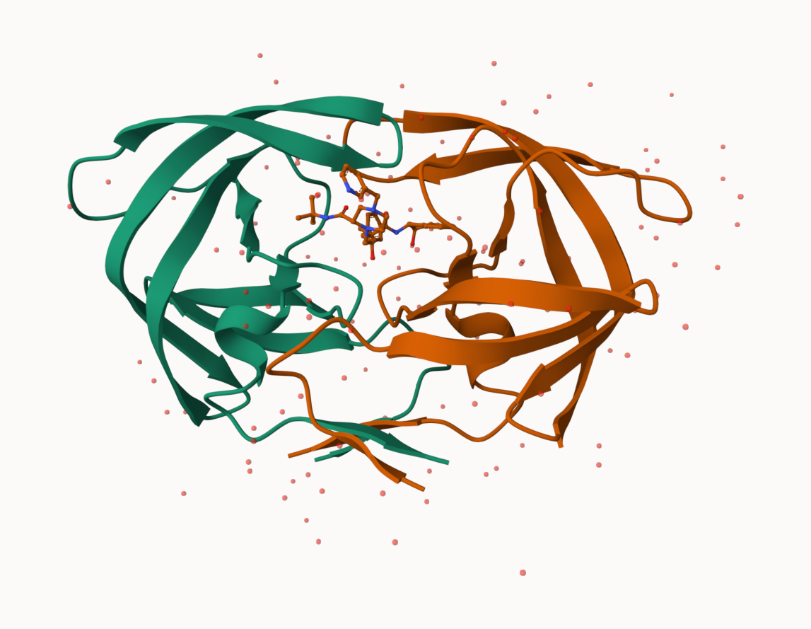
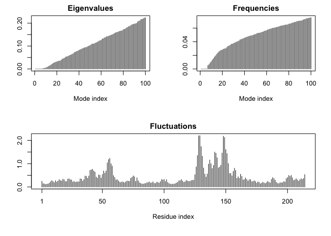

# Class 10: Structural Bioinformatics (pt1)
Seunghoon Oh (PID: A19372132)

- [Introduction to the RCSB Protein Data Bank
  (PDB)](#introduction-to-the-rcsb-protein-data-bank-pdb)
  - [PDB statistics](#pdb-statistics)
- [Visualizing PDB data with
  Mol-star](#visualizing-pdb-data-with-mol-star)
- [Getting started with the Bio3D
  package](#getting-started-with-the-bio3d-package)
- [Predict the flexibility of a given
  structure](#predict-the-flexibility-of-a-given-structure)
- [Comparative structure analysis of the ADK
  family](#comparative-structure-analysis-of-the-adk-family)

## Introduction to the RCSB Protein Data Bank (PDB)

### PDB statistics

``` r
pdb <- read.csv("Data Export Summary.csv")
pdb
```

               Molecular.Type   X.ray     EM    NMR Integrative Multiple.methods
    1          Protein (only) 180,758 23,111 12,813         348              229
    2 Protein/Oligosaccharide  10,488  3,741     34           8               11
    3              Protein/NA   9,205  6,751    287          26                8
    4     Nucleic acid (only)   3,154    250  1,578           3               15
    5                   Other     178     27     35           4                0
    6  Oligosaccharide (only)      11      0      6           0                1
      Neutron Other   Total
    1      84    32 217,375
    2       1     0  14,283
    3       0     0  16,277
    4       3     1   5,004
    5       0     0     244
    6       0     4      22

``` r
pdb$X.ray
```

    [1] "180,758" "10,488"  "9,205"   "3,154"   "178"     "11"     

They print out above `pdb$X.ray` is “character” not “numeric”. Therefore
I can’t do math with it. We need to fix this…

Two functions that can help here are `sub()` and `as.numeric()`.

``` r
#We want to get rid of (or sub out) commas:
as.numeric(sub(",", "", x=pdb$X.ray))
```

    [1] 180758  10488   9205   3154    178     11

We could make a function to do this:

``` r
rm.comma <- function(x) {
  tmp <- sub(",", "", x)
  sum (as.numeric(tmp))
}
rm.comma(pdb$X.ray)
```

    [1] 203794

We could also use a different import function for this CSV that speaks
American. (i.e. deals with commas in numbers in a comma separated value
file)

``` r
library(readr)
pdb_stats <- read_csv("Data Export Summary.csv")
```

    Rows: 6 Columns: 9
    ── Column specification ────────────────────────────────────────────────────────
    Delimiter: ","
    chr (1): Molecular Type
    dbl (4): Integrative, Multiple methods, Neutron, Other
    num (4): X-ray, EM, NMR, Total

    ℹ Use `spec()` to retrieve the full column specification for this data.
    ℹ Specify the column types or set `show_col_types = FALSE` to quiet this message.

> Q1: What percentage of structures in the PDB are solved by X-Ray and
> Electron Microscopy.

Counting **all the structures (not just proteins)**, we have to add up
all the numbers for each column.

``` r
total_num <- sum(pdb_stats$Total)
X.ray_num <- sum(pdb_stats$`X-ray`)
EM_num <- sum(pdb_stats$EM)
cat("X.ray percentage: ", 100*X.ray_num/total_num, "%\n", sep="")
```

    X.ray percentage: 80.48577%

``` r
cat("EM percentage: ", 100*EM_num/total_num, "%", sep="")
```

    EM percentage: 13.38046%

> Q2: What proportion of structures in the PDB are protein?

``` r
Protein_only_num <- pdb_stats$Total[1]
cat("Protein-only percentage: ", 100*Protein_only_num/total_num, "%\n", sep="")
```

    Protein-only percentage: 85.84941%

``` r
Protein_total_num <- sum(pdb_stats$Total[1:3])
cat("Protein-total percentage: ", 100*Protein_total_num/total_num, "%", sep="")
```

    Protein-total percentage: 97.91868%

The total number of protein sequences is 202,556,314 from UniProt
statistics.

``` r
100*Protein_only_num/202556314
```

    [1] 0.1073158

**Key-point**: We have a very, very small structural coverage of known
proteins (~0.1%). Most structures we know about (~80%) come from one
method (X-ray crystallography)

> Q3: Type HIV in the PDB website search box on the home page and
> determine how many HIV-1 protease structures are in the current PDB?
> (Skip)

Professor had skipped this Q, but still the search results gave me the
number of 1,227 structures.

## Visualizing PDB data with Mol-star

Main stand alone web cersion with all features is at
https://molstar.org/viewer/.



 \> Q4: Water molecules normally have 3 atoms. Why
do we see just one atom per water molecule in this structure?

Only the Oxygen atom is indicated. (hydrogen atoms are not depicted)

> Q5: There is a critical “conserved” water molecule in the binding
> site. Can you identify this water molecule? What residue number does
> this water molecule have?

308. (“HOH308”)

> Q6: Generate and save a figure clearly showing the two distinct chains
> of HIV-protease along with the ligand. You might also consider showing
> the catalytic residues ASP 25 in each chain and the critical water (we
> recommend “Ball & Stick” for these side-chains). Add this figure to
> your Quarto document.


## Getting started with the Bio3D package

Bio3D is a R package from CRAN for structural bioinformatics

``` r
library(bio3d)
pdb <- read.pdb("1hsg")
```

      Note: Accessing on-line PDB file

``` r
pdb
```


     Call:  read.pdb(file = "1hsg")

       Total Models#: 1
         Total Atoms#: 1686,  XYZs#: 5058  Chains#: 2  (values: A B)

         Protein Atoms#: 1514  (residues/Calpha atoms#: 198)
         Nucleic acid Atoms#: 0  (residues/phosphate atoms#: 0)

         Non-protein/nucleic Atoms#: 172  (residues: 128)
         Non-protein/nucleic resid values: [ HOH (127), MK1 (1) ]

       Protein sequence:
          PQITLWQRPLVTIKIGGQLKEALLDTGADDTVLEEMSLPGRWKPKMIGGIGGFIKVRQYD
          QILIEICGHKAIGTVLVGPTPVNIIGRNLLTQIGCTLNFPQITLWQRPLVTIKIGGQLKE
          ALLDTGADDTVLEEMSLPGRWKPKMIGGIGGFIKVRQYDQILIEICGHKAIGTVLVGPTP
          VNIIGRNLLTQIGCTLNF

    + attr: atom, xyz, seqres, helix, sheet,
            calpha, remark, call

> Q7: How many amino acid residues are there in this pdb object?

There are 198 amino acid residues (as we can see from the Calpha atoms
count).

> Q8: Name one of the two non-protein residues?

HOH = water.

> Q9: How many protein chains are in this structure?

2 chains. (A and B)

``` r
attributes(pdb)
```

    $names
    [1] "atom"   "xyz"    "seqres" "helix"  "sheet"  "calpha" "remark" "call"  

    $class
    [1] "pdb" "sse"

``` r
head(pdb$atom)
```

      type eleno elety  alt resid chain resno insert      x      y     z o     b
    1 ATOM     1     N <NA>   PRO     A     1   <NA> 29.361 39.686 5.862 1 38.10
    2 ATOM     2    CA <NA>   PRO     A     1   <NA> 30.307 38.663 5.319 1 40.62
    3 ATOM     3     C <NA>   PRO     A     1   <NA> 29.760 38.071 4.022 1 42.64
    4 ATOM     4     O <NA>   PRO     A     1   <NA> 28.600 38.302 3.676 1 43.40
    5 ATOM     5    CB <NA>   PRO     A     1   <NA> 30.508 37.541 6.342 1 37.87
    6 ATOM     6    CG <NA>   PRO     A     1   <NA> 29.296 37.591 7.162 1 38.40
      segid elesy charge
    1  <NA>     N   <NA>
    2  <NA>     C   <NA>
    3  <NA>     C   <NA>
    4  <NA>     O   <NA>
    5  <NA>     C   <NA>
    6  <NA>     C   <NA>

There are lots of functions that we can work with these `pdb` objects

``` r
head(pdbseq(pdb))
```

      1   2   3   4   5   6 
    "P" "Q" "I" "T" "L" "W" 

We can have a quick interactive view of any of these :

``` r
library(bio3dview)
#view.pdb(pdb)
```

Let’s try a custom view

``` r
#view.pdb(pdb,colorScheme="sse", backgroundColor="black")
```

> Q. Create a custom view of HIV-Pr highlighting the active site ASP
> (`resno`=25), the two chains (in your choice of colors) and the ligand
> all on a custom color background?

``` r
library(NGLVieweR)
active.site <- atom.select(pdb, resno=25)
#view.pdb(pdb,
#         cols=c("red", "blue"),
#         highlight=active.site,
#         highlight.style="spacefill",
#         backgroundColor="pink") |>
#  setRock()
```

## Predict the flexibility of a given structure

Let’s do a Normal Mode Analysis (NMA) to predict the flexibility of a
given `pdb` object:

``` r
adk <- read.pdb("6s36")
```

      Note: Accessing on-line PDB file
       PDB has ALT records, taking A only, rm.alt=TRUE

``` r
adk
```


     Call:  read.pdb(file = "6s36")

       Total Models#: 1
         Total Atoms#: 1898,  XYZs#: 5694  Chains#: 1  (values: A)

         Protein Atoms#: 1654  (residues/Calpha atoms#: 214)
         Nucleic acid Atoms#: 0  (residues/phosphate atoms#: 0)

         Non-protein/nucleic Atoms#: 244  (residues: 244)
         Non-protein/nucleic resid values: [ CL (3), HOH (238), MG (2), NA (1) ]

       Protein sequence:
          MRIILLGAPGAGKGTQAQFIMEKYGIPQISTGDMLRAAVKSGSELGKQAKDIMDAGKLVT
          DELVIALVKERIAQEDCRNGFLLDGFPRTIPQADAMKEAGINVDYVLEFDVPDELIVDKI
          VGRRVHAPSGRVYHVKFNPPKVEGKDDVTGEELTTRKDDQEETVRKRLVEYHQMTAPLIG
          YYSKEAEAGNTKYAKVDGTKPVAEVRADLEKILG

    + attr: atom, xyz, seqres, helix, sheet,
            calpha, remark, call

``` r
m <- nma(adk)
```

     Building Hessian...        Done in 0.02 seconds.
     Diagonalizing Hessian...   Done in 0.458 seconds.

``` r
plot(m)
```



``` r
#view.nma(m)
```

Write out the results for viewing in Mol-star:

``` r
mktrj(m, file="nma.pdb")
```

## Comparative structure analysis of the ADK family

> Q10. Which of the packages above is found only on BioConductor and not
> CRAN?

msa

> Q11. Which of the above packages is not found on BioConductor or CRAN?

bio3dview

> Q12. True or False? Functions from the pak package can be used to
> install packages from GitHub and BitBucket?

True

Our first step is to find a sequence for this family. We will use the
database ID “1ake_A” here:

``` r
id <- "1ake_A"

aa <-get.seq(id)
```

    Warning in get.seq(id): Removing existing file: seqs.fasta

    Fetching... Please wait. Done.

``` r
aa
```

                 1        .         .         .         .         .         60 
    pdb|1AKE|A   MRIILLGAPGAGKGTQAQFIMEKYGIPQISTGDMLRAAVKSGSELGKQAKDIMDAGKLVT
                 1        .         .         .         .         .         60 

                61        .         .         .         .         .         120 
    pdb|1AKE|A   DELVIALVKERIAQEDCRNGFLLDGFPRTIPQADAMKEAGINVDYVLEFDVPDELIVDRI
                61        .         .         .         .         .         120 

               121        .         .         .         .         .         180 
    pdb|1AKE|A   VGRRVHAPSGRVYHVKFNPPKVEGKDDVTGEELTTRKDDQEETVRKRLVEYHQMTAPLIG
               121        .         .         .         .         .         180 

               181        .         .         .   214 
    pdb|1AKE|A   YYSKEAEAGNTKYAKVDGTKPVAEVRADLEKILG
               181        .         .         .   214 

    Call:
      read.fasta(file = outfile)

    Class:
      fasta

    Alignment dimensions:
      1 sequence rows; 214 position columns (214 non-gap, 0 gap) 

    + attr: id, ali, call

> Q13. How many amino acids are in this sequence, i.e. how long is this
> sequence?

214 amino acids.

Search for related sequences in the database

``` r
blast <- blast.pdb(aa)
```

     Searching ... please wait (updates every 5 seconds) RID = 1BWHX826014 
     ..
     Reporting 96 hits

``` r
head(blast$hit.tbl)
```

            queryid subjectids identity alignmentlength mismatches gapopens q.start
    1 Query_2439473     1AKE_A  100.000             214          0        0       1
    2 Query_2439473     8BQF_A   99.533             214          1        0       1
    3 Query_2439473     4X8M_A   99.533             214          1        0       1
    4 Query_2439473     6S36_A   99.533             214          1        0       1
    5 Query_2439473     9R6U_A   99.533             214          1        0       1
    6 Query_2439473     9R71_A   99.533             214          1        0       1
      q.end s.start s.end    evalue bitscore positives mlog.evalue pdb.id    acc
    1   214       1   214 1.82e-156      432    100.00    358.6044 1AKE_A 1AKE_A
    2   214      21   234 2.98e-156      433    100.00    358.1114 8BQF_A 8BQF_A
    3   214       1   214 3.26e-156      432    100.00    358.0215 4X8M_A 4X8M_A
    4   214       1   214 4.78e-156      432    100.00    357.6388 6S36_A 6S36_A
    5   214       1   214 1.07e-155      431     99.53    356.8330 9R6U_A 9R6U_A
    6   214       1   214 1.26e-155      431     99.53    356.6696 9R71_A 9R71_A

``` r
hits <- plot(blast)
```

      * Possible cutoff values:    260 3 
                Yielding Nhits:    20 96 

      * Chosen cutoff value of:    260 
                Yielding Nhits:    20 


``` r
hits$pdb.id
```

     [1] "1AKE_A" "8BQF_A" "4X8M_A" "6S36_A" "9R6U_A" "9R71_A" "8Q2B_A" "8RJ9_A"
     [9] "6RZE_A" "4X8H_A" "3HPR_A" "1E4V_A" "5EJE_A" "1E4Y_A" "3X2S_A" "6HAP_A"
    [17] "6HAM_A" "8PVW_A" "4K46_A" "4NP6_A"

``` r
files <- get.pdb(hits$pdb.id, path="pdbs", split=TRUE, gzip=TRUE)
```

    Warning in get.pdb(hits$pdb.id, path = "pdbs", split = TRUE, gzip = TRUE):
    pdbs/1AKE.pdb.gz exists. Skipping download

    Warning in get.pdb(hits$pdb.id, path = "pdbs", split = TRUE, gzip = TRUE):
    pdbs/8BQF.pdb.gz exists. Skipping download

    Warning in get.pdb(hits$pdb.id, path = "pdbs", split = TRUE, gzip = TRUE):
    pdbs/4X8M.pdb.gz exists. Skipping download

    Warning in get.pdb(hits$pdb.id, path = "pdbs", split = TRUE, gzip = TRUE):
    pdbs/6S36.pdb.gz exists. Skipping download

    Warning in get.pdb(hits$pdb.id, path = "pdbs", split = TRUE, gzip = TRUE):
    pdbs/9R6U.pdb.gz exists. Skipping download

    Warning in get.pdb(hits$pdb.id, path = "pdbs", split = TRUE, gzip = TRUE):
    pdbs/9R71.pdb.gz exists. Skipping download

    Warning in get.pdb(hits$pdb.id, path = "pdbs", split = TRUE, gzip = TRUE):
    pdbs/8Q2B.pdb.gz exists. Skipping download

    Warning in get.pdb(hits$pdb.id, path = "pdbs", split = TRUE, gzip = TRUE):
    pdbs/8RJ9.pdb.gz exists. Skipping download

    Warning in get.pdb(hits$pdb.id, path = "pdbs", split = TRUE, gzip = TRUE):
    pdbs/6RZE.pdb.gz exists. Skipping download

    Warning in get.pdb(hits$pdb.id, path = "pdbs", split = TRUE, gzip = TRUE):
    pdbs/4X8H.pdb.gz exists. Skipping download

    Warning in get.pdb(hits$pdb.id, path = "pdbs", split = TRUE, gzip = TRUE):
    pdbs/3HPR.pdb.gz exists. Skipping download

    Warning in get.pdb(hits$pdb.id, path = "pdbs", split = TRUE, gzip = TRUE):
    pdbs/1E4V.pdb.gz exists. Skipping download

    Warning in get.pdb(hits$pdb.id, path = "pdbs", split = TRUE, gzip = TRUE):
    pdbs/5EJE.pdb.gz exists. Skipping download

    Warning in get.pdb(hits$pdb.id, path = "pdbs", split = TRUE, gzip = TRUE):
    pdbs/1E4Y.pdb.gz exists. Skipping download

    Warning in get.pdb(hits$pdb.id, path = "pdbs", split = TRUE, gzip = TRUE):
    pdbs/3X2S.pdb.gz exists. Skipping download

    Warning in get.pdb(hits$pdb.id, path = "pdbs", split = TRUE, gzip = TRUE):
    pdbs/6HAP.pdb.gz exists. Skipping download

    Warning in get.pdb(hits$pdb.id, path = "pdbs", split = TRUE, gzip = TRUE):
    pdbs/6HAM.pdb.gz exists. Skipping download

    Warning in get.pdb(hits$pdb.id, path = "pdbs", split = TRUE, gzip = TRUE):
    pdbs/8PVW.pdb.gz exists. Skipping download

    Warning in get.pdb(hits$pdb.id, path = "pdbs", split = TRUE, gzip = TRUE):
    pdbs/4K46.pdb.gz exists. Skipping download

    Warning in get.pdb(hits$pdb.id, path = "pdbs", split = TRUE, gzip = TRUE):
    pdbs/4NP6.pdb.gz exists. Skipping download


      |                                                                            
      |                                                                      |   0%
      |                                                                            
      |====                                                                  |   5%
      |                                                                            
      |=======                                                               |  10%
      |                                                                            
      |==========                                                            |  15%
      |                                                                            
      |==============                                                        |  20%
      |                                                                            
      |==================                                                    |  25%
      |                                                                            
      |=====================                                                 |  30%
      |                                                                            
      |========================                                              |  35%
      |                                                                            
      |============================                                          |  40%
      |                                                                            
      |================================                                      |  45%
      |                                                                            
      |===================================                                   |  50%
      |                                                                            
      |======================================                                |  55%
      |                                                                            
      |==========================================                            |  60%
      |                                                                            
      |==============================================                        |  65%
      |                                                                            
      |=================================================                     |  70%
      |                                                                            
      |====================================================                  |  75%
      |                                                                            
      |========================================================              |  80%
      |                                                                            
      |============================================================          |  85%
      |                                                                            
      |===============================================================       |  90%
      |                                                                            
      |==================================================================    |  95%
      |                                                                            
      |======================================================================| 100%

Align and superpose all these ADK structures

``` r
pdbs <- pdbaln(files, fit = TRUE, exefile="msa")
```

    Reading PDB files:
    pdbs/split_chain/1AKE_A.pdb
    pdbs/split_chain/8BQF_A.pdb
    pdbs/split_chain/4X8M_A.pdb
    pdbs/split_chain/6S36_A.pdb
    pdbs/split_chain/9R6U_A.pdb
    pdbs/split_chain/9R71_A.pdb
    pdbs/split_chain/8Q2B_A.pdb
    pdbs/split_chain/8RJ9_A.pdb
    pdbs/split_chain/6RZE_A.pdb
    pdbs/split_chain/4X8H_A.pdb
    pdbs/split_chain/3HPR_A.pdb
    pdbs/split_chain/1E4V_A.pdb
    pdbs/split_chain/5EJE_A.pdb
    pdbs/split_chain/1E4Y_A.pdb
    pdbs/split_chain/3X2S_A.pdb
    pdbs/split_chain/6HAP_A.pdb
    pdbs/split_chain/6HAM_A.pdb
    pdbs/split_chain/8PVW_A.pdb
    pdbs/split_chain/4K46_A.pdb
    pdbs/split_chain/4NP6_A.pdb
       PDB has ALT records, taking A only, rm.alt=TRUE
    .   PDB has ALT records, taking A only, rm.alt=TRUE
    ..   PDB has ALT records, taking A only, rm.alt=TRUE
    .   PDB has ALT records, taking A only, rm.alt=TRUE
    .   PDB has ALT records, taking A only, rm.alt=TRUE
    .   PDB has ALT records, taking A only, rm.alt=TRUE
    .   PDB has ALT records, taking A only, rm.alt=TRUE
    .   PDB has ALT records, taking A only, rm.alt=TRUE
    ..   PDB has ALT records, taking A only, rm.alt=TRUE
    ..   PDB has ALT records, taking A only, rm.alt=TRUE
    ....   PDB has ALT records, taking A only, rm.alt=TRUE
    .   PDB has ALT records, taking A only, rm.alt=TRUE
    .   PDB has ALT records, taking A only, rm.alt=TRUE
    ..

    Extracting sequences

    pdb/seq: 1   name: pdbs/split_chain/1AKE_A.pdb 
       PDB has ALT records, taking A only, rm.alt=TRUE
    pdb/seq: 2   name: pdbs/split_chain/8BQF_A.pdb 
       PDB has ALT records, taking A only, rm.alt=TRUE
    pdb/seq: 3   name: pdbs/split_chain/4X8M_A.pdb 
    pdb/seq: 4   name: pdbs/split_chain/6S36_A.pdb 
       PDB has ALT records, taking A only, rm.alt=TRUE
    pdb/seq: 5   name: pdbs/split_chain/9R6U_A.pdb 
       PDB has ALT records, taking A only, rm.alt=TRUE
    pdb/seq: 6   name: pdbs/split_chain/9R71_A.pdb 
       PDB has ALT records, taking A only, rm.alt=TRUE
    pdb/seq: 7   name: pdbs/split_chain/8Q2B_A.pdb 
       PDB has ALT records, taking A only, rm.alt=TRUE
    pdb/seq: 8   name: pdbs/split_chain/8RJ9_A.pdb 
       PDB has ALT records, taking A only, rm.alt=TRUE
    pdb/seq: 9   name: pdbs/split_chain/6RZE_A.pdb 
       PDB has ALT records, taking A only, rm.alt=TRUE
    pdb/seq: 10   name: pdbs/split_chain/4X8H_A.pdb 
    pdb/seq: 11   name: pdbs/split_chain/3HPR_A.pdb 
       PDB has ALT records, taking A only, rm.alt=TRUE
    pdb/seq: 12   name: pdbs/split_chain/1E4V_A.pdb 
    pdb/seq: 13   name: pdbs/split_chain/5EJE_A.pdb 
       PDB has ALT records, taking A only, rm.alt=TRUE
    pdb/seq: 14   name: pdbs/split_chain/1E4Y_A.pdb 
    pdb/seq: 15   name: pdbs/split_chain/3X2S_A.pdb 
    pdb/seq: 16   name: pdbs/split_chain/6HAP_A.pdb 
    pdb/seq: 17   name: pdbs/split_chain/6HAM_A.pdb 
       PDB has ALT records, taking A only, rm.alt=TRUE
    pdb/seq: 18   name: pdbs/split_chain/8PVW_A.pdb 
       PDB has ALT records, taking A only, rm.alt=TRUE
    pdb/seq: 19   name: pdbs/split_chain/4K46_A.pdb 
       PDB has ALT records, taking A only, rm.alt=TRUE
    pdb/seq: 20   name: pdbs/split_chain/4NP6_A.pdb 

``` r
pdbs
```

                                    1        .         .         .         40 
    [Truncated_Name:1]1AKE_A.pdb    --MRIILLGAPGAGKGTQAQFIMEKYGIPQISTGDMLRAA
    [Truncated_Name:2]8BQF_A.pdb    --MRIILLGAPGAGKGTQAQFIMEKYGIPQISTGDMLRAA
    [Truncated_Name:3]4X8M_A.pdb    --MRIILLGAPGAGKGTQAQFIMEKYGIPQISTGDMLRAA
    [Truncated_Name:4]6S36_A.pdb    --MRIILLGAPGAGKGTQAQFIMEKYGIPQISTGDMLRAA
    [Truncated_Name:5]9R6U_A.pdb    --MRIILLGAPGAGKGTQAQFIMEKYGIPQISTGDMLRAA
    [Truncated_Name:6]9R71_A.pdb    --MRIILLGAPGAGKGTQAQFIMEKYGIPQISTGDMLRAA
    [Truncated_Name:7]8Q2B_A.pdb    --MRIILLGAPGAGKGTQAQFIMEKYGIPQISTGDMLRAA
    [Truncated_Name:8]8RJ9_A.pdb    --MRIILLGAPGAGKGTQAQFIMEKYGIPQISTGDMLRAA
    [Truncated_Name:9]6RZE_A.pdb    --MRIILLGAPGAGKGTQAQFIMEKYGIPQISTGDMLRAA
    [Truncated_Name:10]4X8H_A.pdb   --MRIILLGAPGAGKGTQAQFIMEKYGIPQISTGDMLRAA
    [Truncated_Name:11]3HPR_A.pdb   --MRIILLGAPGAGKGTQAQFIMEKYGIPQISTGDMLRAA
    [Truncated_Name:12]1E4V_A.pdb   --MRIILLGAPVAGKGTQAQFIMEKYGIPQISTGDMLRAA
    [Truncated_Name:13]5EJE_A.pdb   --MRIILLGAPGAGKGTQAQFIMEKYGIPQISTGDMLRAA
    [Truncated_Name:14]1E4Y_A.pdb   --MRIILLGALVAGKGTQAQFIMEKYGIPQISTGDMLRAA
    [Truncated_Name:15]3X2S_A.pdb   --MRIILLGAPGAGKGTQAQFIMEKYGIPQISTGDMLRAA
    [Truncated_Name:16]6HAP_A.pdb   --MRIILLGAPGAGKGTQAQFIMEKYGIPQISTGDMLRAA
    [Truncated_Name:17]6HAM_A.pdb   --MRIILLGAPGAGKGTQAQFIMEKYGIPQISTGDMLRAA
    [Truncated_Name:18]8PVW_A.pdb   --MRIILLGAPGAGKGTQAQFIMEKYGIPQISTGDMLRAA
    [Truncated_Name:19]4K46_A.pdb   --MRIILLGAPGAGKGTQAQFIMAKFGIPQISTGDMLRAA
    [Truncated_Name:20]4NP6_A.pdb   NAMRIILLGAPGAGKGTQAQFIMEKFGIPQISTGDMLRAA
                                      ********  *********** *^************** 
                                    1        .         .         .         40 

                                   41        .         .         .         80 
    [Truncated_Name:1]1AKE_A.pdb    VKSGSELGKQAKDIMDAGKLVTDELVIALVKERIAQEDCR
    [Truncated_Name:2]8BQF_A.pdb    VKSGSELGKQAKDIMDAGKLVTDELVIALVKERIAQE---
    [Truncated_Name:3]4X8M_A.pdb    VKSGSELGKQAKDIMDAGKLVTDELVIALVKERIAQEDCR
    [Truncated_Name:4]6S36_A.pdb    VKSGSELGKQAKDIMDAGKLVTDELVIALVKERIAQEDCR
    [Truncated_Name:5]9R6U_A.pdb    VKSGSELGAQAKDIMDAGKLVTDELVIALVKERIAQEDCR
    [Truncated_Name:6]9R71_A.pdb    VKSGSELGKQAKDIMDAGKLVTDELVIALVKERIAQEDCR
    [Truncated_Name:7]8Q2B_A.pdb    VKSGSELGKQAKDIMDAGKLVTDELVIALVKERIAQEDCR
    [Truncated_Name:8]8RJ9_A.pdb    VKSGSELGKQAKDIMDAGKLVTDELVIALVKERIAQEDCR
    [Truncated_Name:9]6RZE_A.pdb    VKSGSELGKQAKDIMDAGKLVTDELVIALVKERIAQEDCR
    [Truncated_Name:10]4X8H_A.pdb   VKSGSELGKQAKDIMDAGKLVTDELVIALVKERIAQEDCR
    [Truncated_Name:11]3HPR_A.pdb   VKSGSELGKQAKDIMDAGKLVTDELVIALVKERIAQEDCR
    [Truncated_Name:12]1E4V_A.pdb   VKSGSELGKQAKDIMDAGKLVTDELVIALVKERIAQEDCR
    [Truncated_Name:13]5EJE_A.pdb   VKSGSELGKQAKDIMDACKLVTDELVIALVKERIAQEDCR
    [Truncated_Name:14]1E4Y_A.pdb   VKSGSELGKQAKDIMDAGKLVTDELVIALVKERIAQEDCR
    [Truncated_Name:15]3X2S_A.pdb   VKSGSELGKQAKDIMDCGKLVTDELVIALVKERIAQEDSR
    [Truncated_Name:16]6HAP_A.pdb   VKSGSELGKQAKDIMDAGKLVTDELVIALVRERICQEDSR
    [Truncated_Name:17]6HAM_A.pdb   IKSGSELGKQAKDIMDAGKLVTDEIIIALVKERICQEDSR
    [Truncated_Name:18]8PVW_A.pdb   VKSGSELGKQAKDIMDAGKLVTDELVIALVKERIAQEDCR
    [Truncated_Name:19]4K46_A.pdb   IKAGTELGKQAKSVIDAGQLVSDDIILGLVKERIAQDDCA
    [Truncated_Name:20]4NP6_A.pdb   IKAGTELGKQAKAVIDAGQLVSDDIILGLIKERIAQADCE
                                    ^* *^*** *** ^^*   **^*^^^^^*^^*** *     
                                   41        .         .         .         80 

                                   81        .         .         .         120 
    [Truncated_Name:1]1AKE_A.pdb    NGFLLDGFPRTIPQADAMKEAGINVDYVLEFDVPDELIVD
    [Truncated_Name:2]8BQF_A.pdb    -GFLLDGFPRTIPQADAMKEAGINVDYVIEFDVPDELIVD
    [Truncated_Name:3]4X8M_A.pdb    NGFLLDGFPRTIPQADAMKEAGINVDYVLEFDVPDELIVD
    [Truncated_Name:4]6S36_A.pdb    NGFLLDGFPRTIPQADAMKEAGINVDYVLEFDVPDELIVD
    [Truncated_Name:5]9R6U_A.pdb    NGFLLDGFPRTIPQADAMKEAGINVDYVLEFDVPDELIVD
    [Truncated_Name:6]9R71_A.pdb    NGFLLDGFPRTIPQADAMKEAGINVDYVLEFDVPDALIVD
    [Truncated_Name:7]8Q2B_A.pdb    NGFLLDGFPRTIPQADAMKEAGINVDYVLEFDVPDELIVD
    [Truncated_Name:8]8RJ9_A.pdb    NGFLLAGFPRTIPQADAMKEAGINVDYVLEFDVPDELIVD
    [Truncated_Name:9]6RZE_A.pdb    NGFLLDGFPRTIPQADAMKEAGINVDYVLEFDVPDELIVD
    [Truncated_Name:10]4X8H_A.pdb   NGFLLDGFPRTIPQADAMKEAGINVDYVLEFDVPDELIVD
    [Truncated_Name:11]3HPR_A.pdb   NGFLLDGFPRTIPQADAMKEAGINVDYVLEFDVPDELIVD
    [Truncated_Name:12]1E4V_A.pdb   NGFLLDGFPRTIPQADAMKEAGINVDYVLEFDVPDELIVD
    [Truncated_Name:13]5EJE_A.pdb   NGFLLDGFPRTIPQADAMKEAGINVDYVLEFDVPDELIVD
    [Truncated_Name:14]1E4Y_A.pdb   NGFLLDGFPRTIPQADAMKEAGINVDYVLEFDVPDELIVD
    [Truncated_Name:15]3X2S_A.pdb   NGFLLDGFPRTIPQADAMKEAGINVDYVLEFDVPDELIVD
    [Truncated_Name:16]6HAP_A.pdb   NGFLLDGFPRTIPQADAMKEAGINVDYVLEFDVPDELIVD
    [Truncated_Name:17]6HAM_A.pdb   NGFLLDGFPRTIPQADAMKEAGINVDYVLEFDVPDELIVD
    [Truncated_Name:18]8PVW_A.pdb   NGFLLDGFPRTIPQADAMKEAGINVDYVLEFDVPDELIVD
    [Truncated_Name:19]4K46_A.pdb   KGFLLDGFPRTIPQADGLKEVGVVVDYVIEFDVADSVIVE
    [Truncated_Name:20]4NP6_A.pdb   KGFLLDGFPRTIPQADGLKEMGINVDYVIEFDVADDVIVE
                                     **** **********^^** *^ ****^**** * ^**^ 
                                   81        .         .         .         120 

                                  121        .         .         .         160 
    [Truncated_Name:1]1AKE_A.pdb    RIVGRRVHAPSGRVYHVKFNPPKVEGKDDVTGEELTTRKD
    [Truncated_Name:2]8BQF_A.pdb    RIVGRRVHAPSGRVYHVKFNPPKVEGKDDVTGEELTTRKD
    [Truncated_Name:3]4X8M_A.pdb    RIVGRRVHAPSGRVYHVKFNPPKVEGKDDVTGEELTTRKD
    [Truncated_Name:4]6S36_A.pdb    KIVGRRVHAPSGRVYHVKFNPPKVEGKDDVTGEELTTRKD
    [Truncated_Name:5]9R6U_A.pdb    RIVGRRVHAPSGRVYHVKFNPPKVEGKDDVTGEELTTRKD
    [Truncated_Name:6]9R71_A.pdb    RIVGRRVHAPSGRVYHVKFNPPKVEGKDDVTGEELTTRKD
    [Truncated_Name:7]8Q2B_A.pdb    RIVGRRVHAPSGRVYHVKFNPPKVEGKDDVTGEELTTRKA
    [Truncated_Name:8]8RJ9_A.pdb    RIVGRRVHAPSGRVYHVKFNPPKVEGKDDVTGEELTTRKD
    [Truncated_Name:9]6RZE_A.pdb    AIVGRRVHAPSGRVYHVKFNPPKVEGKDDVTGEELTTRKD
    [Truncated_Name:10]4X8H_A.pdb   RIVGRRVHAPSGRVYHVKFNPPKVEGKDDVTGEELTTRKD
    [Truncated_Name:11]3HPR_A.pdb   RIVGRRVHAPSGRVYHVKFNPPKVEGKDDGTGEELTTRKD
    [Truncated_Name:12]1E4V_A.pdb   RIVGRRVHAPSGRVYHVKFNPPKVEGKDDVTGEELTTRKD
    [Truncated_Name:13]5EJE_A.pdb   RIVGRRVHAPSGRVYHVKFNPPKVEGKDDVTGEELTTRKD
    [Truncated_Name:14]1E4Y_A.pdb   RIVGRRVHAPSGRVYHVKFNPPKVEGKDDVTGEELTTRKD
    [Truncated_Name:15]3X2S_A.pdb   RIVGRRVHAPSGRVYHVKFNPPKVEGKDDVTGEELTTRKD
    [Truncated_Name:16]6HAP_A.pdb   RIVGRRVHAPSGRVYHVKFNPPKVEGKDDVTGEELTTRKD
    [Truncated_Name:17]6HAM_A.pdb   RIVGRRVHAPSGRVYHVKFNPPKVEGKDDVTGEELTTRKD
    [Truncated_Name:18]8PVW_A.pdb   RILKR--GETSGRV-------------------------D
    [Truncated_Name:19]4K46_A.pdb   RMAGRRAHLASGRTYHNVYNPPKVEGKDDVTGEDLVIRED
    [Truncated_Name:20]4NP6_A.pdb   RMAGRRAHLPSGRTYHVVYNPPKVEGKDDVTGEDLVIRED
                                     ^  *     ***                            
                                  121        .         .         .         160 

                                  161        .         .         .         200 
    [Truncated_Name:1]1AKE_A.pdb    DQEETVRKRLVEYHQMTAPLIGYYSKEAEAGNTKYAKVDG
    [Truncated_Name:2]8BQF_A.pdb    DQEETVRKRLVEYHQMTAPLIGYYSKEAEAGNTKYAKVDG
    [Truncated_Name:3]4X8M_A.pdb    DQEETVRKRLVEWHQMTAPLIGYYSKEAEAGNTKYAKVDG
    [Truncated_Name:4]6S36_A.pdb    DQEETVRKRLVEYHQMTAPLIGYYSKEAEAGNTKYAKVDG
    [Truncated_Name:5]9R6U_A.pdb    DQEETVRKRLVEYHQMTAPLIGYYSKEAEAGNTKYAKVDG
    [Truncated_Name:6]9R71_A.pdb    DQEETVRKRLVEYHQMTAPLIGYYSKEAEAGNTKYAKVDG
    [Truncated_Name:7]8Q2B_A.pdb    DQEETVRKRLVEYHQMTAPLIGYYSKEAEAGNTKYAKVDG
    [Truncated_Name:8]8RJ9_A.pdb    DQEETVRKRLVEYHQMTAPLIGYYSKEAEAGNTKYAKVDG
    [Truncated_Name:9]6RZE_A.pdb    DQEETVRKRLVEYHQMTAPLIGYYSKEAEAGNTKYAKVDG
    [Truncated_Name:10]4X8H_A.pdb   DQEETVRKRLVEYHQMTAALIGYYSKEAEAGNTKYAKVDG
    [Truncated_Name:11]3HPR_A.pdb   DQEETVRKRLVEYHQMTAPLIGYYSKEAEAGNTKYAKVDG
    [Truncated_Name:12]1E4V_A.pdb   DQEETVRKRLVEYHQMTAPLIGYYSKEAEAGNTKYAKVDG
    [Truncated_Name:13]5EJE_A.pdb   DQEECVRKRLVEYHQMTAPLIGYYSKEAEAGNTKYAKVDG
    [Truncated_Name:14]1E4Y_A.pdb   DQEETVRKRLVEYHQMTAPLIGYYSKEAEAGNTKYAKVDG
    [Truncated_Name:15]3X2S_A.pdb   DQEETVRKRLCEYHQMTAPLIGYYSKEAEAGNTKYAKVDG
    [Truncated_Name:16]6HAP_A.pdb   DQEETVRKRLVEYHQMTAPLIGYYSKEAEAGNTKYAKVDG
    [Truncated_Name:17]6HAM_A.pdb   DQEETVRKRLVEYHQMTAPLIGYYSKEAEAGNTKYAKVDG
    [Truncated_Name:18]8PVW_A.pdb   DNEETVRKRLVEYHQMTAPLIGYYSKEAEAGNTKYAKVDG
    [Truncated_Name:19]4K46_A.pdb   DKEETVLARLGVYHNQTAPLIAYYGKEAEAGNTQYLKFDG
    [Truncated_Name:20]4NP6_A.pdb   DKEETVRARLNVYHTQTAPLIEYYGKEAAAGKTQYLKFDG
                                    * ** *  **  ^*  ** ** ** *** ** * * * ** 
                                  161        .         .         .         200 

                                  201        .     216 
    [Truncated_Name:1]1AKE_A.pdb    TKPVAEVRADLEKILG
    [Truncated_Name:2]8BQF_A.pdb    TKPVAEVRADLEKIL-
    [Truncated_Name:3]4X8M_A.pdb    TKPVAEVRADLEKILG
    [Truncated_Name:4]6S36_A.pdb    TKPVAEVRADLEKILG
    [Truncated_Name:5]9R6U_A.pdb    TKPVAEVRADLEKILG
    [Truncated_Name:6]9R71_A.pdb    TKPVAEVRADLEKILG
    [Truncated_Name:7]8Q2B_A.pdb    TKPVAEVRADLEKILG
    [Truncated_Name:8]8RJ9_A.pdb    TKPVAEVRADLEKILG
    [Truncated_Name:9]6RZE_A.pdb    TKPVAEVRADLEKILG
    [Truncated_Name:10]4X8H_A.pdb   TKPVAEVRADLEKILG
    [Truncated_Name:11]3HPR_A.pdb   TKPVAEVRADLEKILG
    [Truncated_Name:12]1E4V_A.pdb   TKPVAEVRADLEKILG
    [Truncated_Name:13]5EJE_A.pdb   TKPVAEVRADLEKILG
    [Truncated_Name:14]1E4Y_A.pdb   TKPVAEVRADLEKILG
    [Truncated_Name:15]3X2S_A.pdb   TKPVAEVRADLEKILG
    [Truncated_Name:16]6HAP_A.pdb   TKPVCEVRADLEKILG
    [Truncated_Name:17]6HAM_A.pdb   TKPVCEVRADLEKILG
    [Truncated_Name:18]8PVW_A.pdb   TKPVAEVRADLEKILG
    [Truncated_Name:19]4K46_A.pdb   TKAVAEVSAELEKALA
    [Truncated_Name:20]4NP6_A.pdb   TKQVSEVSADIAKALA
                                    ** * ** *^^ * *  
                                  201        .     216 

    Call:
      pdbaln(files = files, fit = TRUE, exefile = "msa")

    Class:
      pdbs, fasta

    Alignment dimensions:
      20 sequence rows; 216 position columns (182 non-gap, 34 gap) 

    + attr: xyz, resno, b, chain, id, ali, resid, sse, call

``` r
#view.pdbs(pdbs)
```

PCA of all these structural data (x, y and z atom coordinates):

``` r
pc <- pca(pdbs)
plot(pc, 1:2)
```


Interactive view of the PC1 captured structure

``` r
#view.pca(pc)
```

``` r
mktrj(pc, file="pca.pdb")
```
