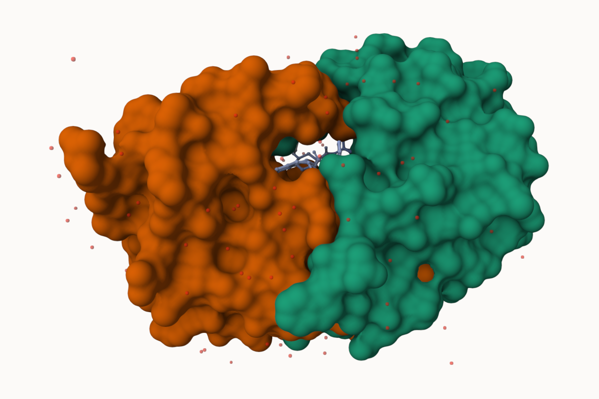
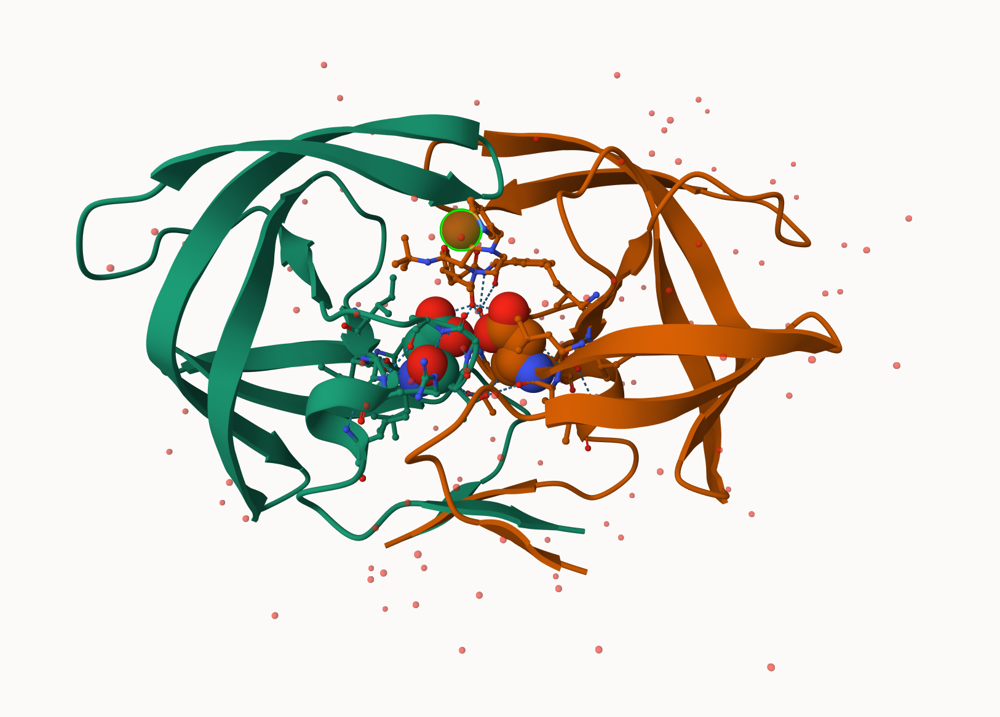

## Introduction to the RCSB Protein Data Bank (PDB)

### PDB statistics

```{r}
pdb <- read.csv("Data Export Summary.csv")
pdb
```

```{r}
pdb$X.ray
```


They print out above `pdb$X.ray` is "character" not "numeric". Therefore I can't do math with it. We need to fix this...

Two functions that can help here are `sub()` and `as.numeric()`.

```{r}
#We want to get rid of (or sub out) commas:
as.numeric(sub(",", "", x=pdb$X.ray))
```

We could make a function to do this:

```{r}
rm.comma <- function(x) {
  tmp <- sub(",", "", x)
  sum (as.numeric(tmp))
}
rm.comma(pdb$X.ray)
```

We could also use a different import function for this CSV that speaks American. (i.e. deals with commas in numbers in a comma separated value file)

```{r}
library(readr)
pdb_stats <- read_csv("Data Export Summary.csv")
```


> Q1: What percentage of structures in the PDB are solved by X-Ray and Electron Microscopy.

Counting **all the structures (not just proteins)**, we have to add up all the numbers for each column.

```{r}
total_num <- sum(pdb_stats$Total)
X.ray_num <- sum(pdb_stats$`X-ray`)
EM_num <- sum(pdb_stats$EM)
cat("X.ray percentage: ", 100*X.ray_num/total_num, "%\n", sep="")
cat("EM percentage: ", 100*EM_num/total_num, "%", sep="")
```


> Q2: What proportion of structures in the PDB are protein?

```{r}
Protein_only_num <- pdb_stats$Total[1]
cat("Protein-only percentage: ", 100*Protein_only_num/total_num, "%\n", sep="")

Protein_total_num <- sum(pdb_stats$Total[1:3])
cat("Protein-total percentage: ", 100*Protein_total_num/total_num, "%", sep="")
```

The total number of protein sequences is 202,556,314 from UniProt statistics.

```{r}
100*Protein_only_num/202556314
```

**Key-point**: We have a very, very small structural coverage of known proteins (~0.1%). Most structures we know about (~80%) come from one method (X-ray crystallography)

> Q3: Type HIV in the PDB website search box on the home page and determine how many HIV-1 protease structures are in the current PDB? (Skip)

Professor had skipped this Q, but still the search results gave me the number of 1,227 structures.


## Visualizing PDB data with Mol-star

Main stand alone web cersion with all features is at
https://molstar.org/viewer/.



> Q4: Water molecules normally have 3 atoms. Why do we see just one atom per water molecule in this structure?

Only the Oxygen atom is indicated. (hydrogen atoms are not depicted)

> Q5: There is a critical “conserved” water molecule in the binding site. Can you identify this water molecule? What residue number does this water molecule have?

308. ("HOH308")

> Q6: Generate and save a figure clearly showing the two distinct chains of HIV-protease along with the ligand. You might also consider showing the catalytic residues ASP 25 in each chain and the critical water (we recommend “Ball & Stick” for these side-chains). Add this figure to your Quarto document.



## Getting started with the Bio3D package

Bio3D is a R package from CRAN for structural bioinformatics

```{r}
library(bio3d)
pdb <- read.pdb("1hsg")
pdb
```

> Q7: How many amino acid residues are there in this pdb object? 

There are 198 amino acid residues (as we can see from the Calpha atoms count).

> Q8: Name one of the two non-protein residues?

HOH = water.

> Q9: How many protein chains are in this structure? 

2 chains. (A and B)

```{r}
attributes(pdb)

head(pdb$atom)
```

There are lots of functions that we can work with these `pdb` objects

```{r}
head(pdbseq(pdb))

```

We can have a quick interactive view of any of these :
```{r}
library(bio3dview)
#view.pdb(pdb)
```

Let's try a custom view
```{r}
#view.pdb(pdb,colorScheme="sse", backgroundColor="black")
```

> Q. Create a custom view of HIV-Pr highlighting the active site ASP (`resno`=25), the two chains (in your choice of colors) and the ligand all on a custom color background?

```{r}
library(NGLVieweR)
active.site <- atom.select(pdb, resno=25)
#view.pdb(pdb,
#         cols=c("red", "blue"),
#         highlight=active.site,
#         highlight.style="spacefill",
#         backgroundColor="pink") |>
#  setRock()
```

## Predict the flexibility of a given structure

Let's do a Normal Mode Analysis (NMA) to predict the flexibility of a given `pdb` object:

```{r}
adk <- read.pdb("6s36")
adk
```

```{r}
m <- nma(adk)
plot(m)
```

```{r}
#view.nma(m)
```
Write out the results for viewing in Mol-star:
```{r}
mktrj(m, file="nma.pdb")
```

## Comparative structure analysis of the ADK family

> Q10. Which of the packages above is found only on BioConductor and not CRAN?

msa 

> Q11. Which of the above packages is not found on BioConductor or CRAN?

bio3dview

> Q12. True or False? Functions from the pak package can be used to install packages from GitHub and BitBucket?

True

Our first step is to find a sequence for this family. We will use the database ID "1ake_A" here:

```{r}
id <- "1ake_A"

aa <-get.seq(id)
aa
```

> Q13. How many amino acids are in this sequence, i.e. how long is this sequence?

214 amino acids.

Search for related sequences in the database

```{r}
blast <- blast.pdb(aa)
```

```{r}
head(blast$hit.tbl)
```

```{r}
hits <- plot(blast)
```

```{r}
hits$pdb.id
```

```{r}
files <- get.pdb(hits$pdb.id, path="pdbs", split=TRUE, gzip=TRUE)
```
Align and superpose all these ADK structures

```{r}
pdbs <- pdbaln(files, fit = TRUE, exefile="msa")
```
```{r}
pdbs
```
```{r}
#view.pdbs(pdbs)
```
PCA of all these structural data (x, y and z atom coordinates):

```{r}
pc <- pca(pdbs)
plot(pc, 1:2)
```

Interactive view of the PC1 captured structure

```{r}
#view.pca(pc)
```


```{r}
mktrj(pc, file="pca.pdb")
```

